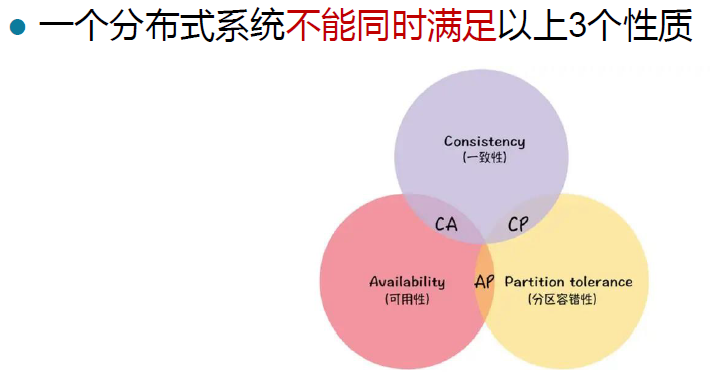
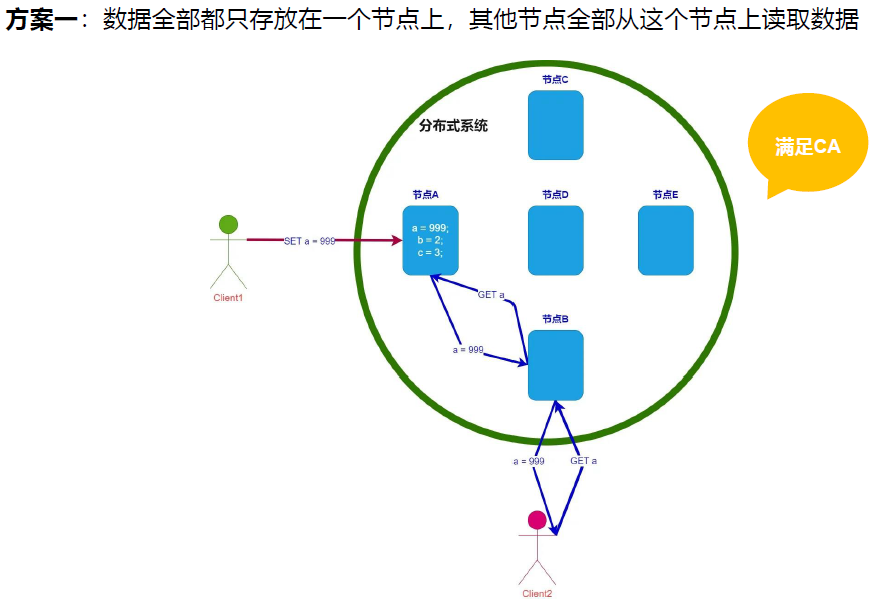
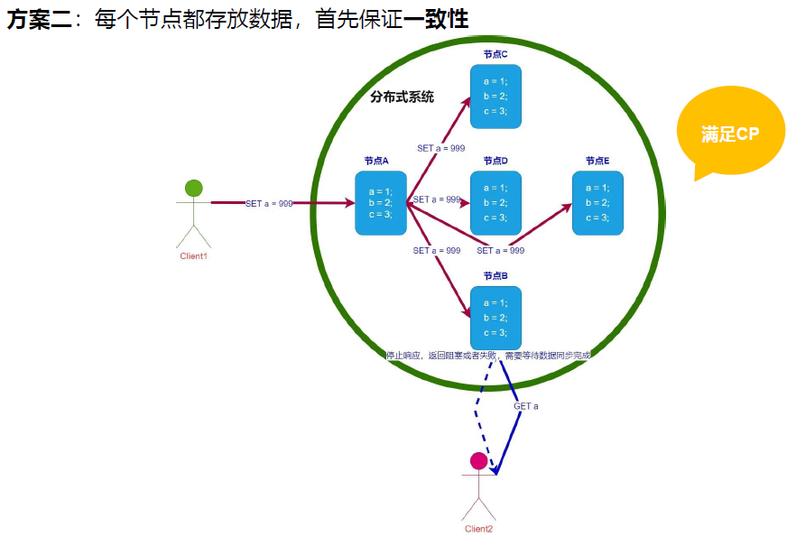
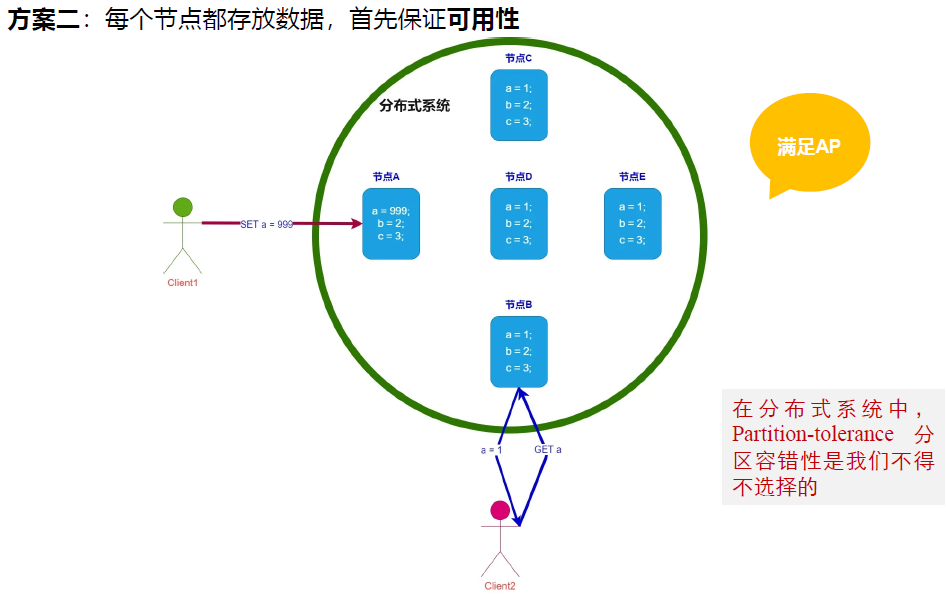

## CAP

CAP理论是分布式计算中的一个重要理论，由Eric Brewer在2000年提出。CAP是Consistency（一致性）、Availability（可用性）和Partition tolerance（分区容忍性）的首字母缩写。

<!--more-->

1. **一致性（Consistency）**：在分布式系统中，一致性是指所有节点在同一时刻看到的数据是一致的。换句话说，如果一个操作导致一份数据发生变化，那么每个节点都应该同时看到这个变化。
2. **可用性（Availability）**：在分布式系统中，可用性是指系统能够在任何时候提供非错的响应--即只要接收到请求，系统总是能在有限的时间内返回结果。
3. **分区容忍性（Partition tolerance）**：在分布式系统中，分区容忍性是指系统能够在网络分区（即节点之间的通信失败）的情况下继续运行。

CAP理论的主要观点是，在任何给定的时刻，分布式系统只能满足这三个属性中的两个。换句话说，无法设计一个同时满足一致性、可用性和分区容忍性的分布式系统。

## 强一致性和最终一致性

是描述分布式系统中数据一致性模型的两个术语。

1. **强一致性**：在强一致性模型中，一旦数据更新成功，所有的读操作都将返回最新的值。换句话说，所有客户端无论何时读取数据，都将看到相同的数据版本。
2. **最终一致性**：在最终一致性模型中，系统保证在没有新的更新操作的情况下，经过一段时间后，所有的读操作最终都将返回最新的值。换句话说，如果系统没有新的更新，那么经过一段时间后，所有客户端都将看到相同的数据版本。但在这段时间内，不同的客户端可能会看到不同的数据版本。

这两种一致性模型各有优缺点。强一致性模型提供了更直观和简单的行为，但可能需要更多的资源（如网络带宽、CPU时间等）来实现。最终一致性模型可能需要更复杂的编程模型，但在某些情况下，它可以提供更高的性能和可用性。在实际的系统设计中，需要根据具体的应用场景和需求来选择合适的一致性模型。
