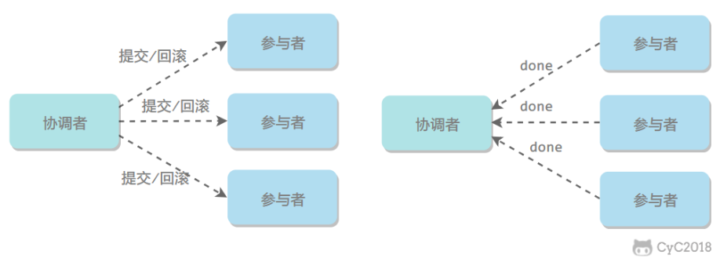

<!--more-->

## 一、分布式锁

在单机场景下，可以使用语言的内置锁来实现进程同步。但是在分布式场景下，需要同步的进程可能位于不同的节点上，那么就需要使用分布式锁。

阻塞锁通常使用互斥量来实现：

- 互斥量为 0 表示有其它进程在使用锁，此时处于锁定状态；
- 互斥量为 1 表示未锁定状态。

1 和 0 可以用一个整型值表示，也可以用某个数据是否存在表示。

## 强一致性和最终一致性

是描述分布式系统中数据一致性模型的两个术语。

1. **强一致性**：在强一致性模型中，一旦数据更新成功，所有的读操作都将返回最新的值。换句话说，所有客户端无论何时读取数据，都将看到相同的数据版本。
2. **最终一致性**：在最终一致性模型中，系统保证在没有新的更新操作的情况下，经过一段时间后，所有的读操作最终都将返回最新的值。换句话说，如果系统没有新的更新，那么经过一段时间后，所有客户端都将看到相同的数据版本。但在这段时间内，不同的客户端可能会看到不同的数据版本。

这两种一致性模型各有优缺点。强一致性模型提供了更直观和简单的行为，但可能需要更多的资源（如网络带宽、CPU 时间等）来实现。最终一致性模型可能需要更复杂的编程模型，但在某些情况下，它可以提供更高的性能和可用性。在实际的系统设计中，需要根据具体的应用场景和需求来选择合适的一致性模型。

## 二、分布式事务

### 2PC

两阶段提交（Two-phase Commit，2PC），通过引入协调者（Coordinator）来协调参与者的行为，并最终决定这些参与者是否要真正执行事务。

#### 1. 运行过程

##### 1.1 准备阶段

协调者询问参与者事务是否执行成功（未提交），参与者发回事务执行结果。询问可以看成一种投票，需要参与者都同意才能执行。

1.2 提交阶段

如果事务在每个参与者上都执行成功，事务协调者发送通知让参与者提交事务；否则，协调者发送通知让参与者回滚事务。

需要注意的是，在准备阶段，参与者执行了事务，但是还未提交。只有在提交阶段接收到协调者发来的通知后，才进行提交或者回滚。

#### 2. 存在的问题

##### 2.1 同步阻塞

所有事务参与者在等待其它参与者响应的时候都处于同步阻塞等待状态，无法进行其它操作。

##### 2.2 单点问题

协调者在 2PC 中起到非常大的作用，发生故障将会造成很大影响。特别是在提交阶段发生故障，所有参与者会一直同步阻塞等待，无法完成其它操作。

##### 2.3 数据不一致

在提交阶段，如果协调者只发送了部分 Commit 消息，此时网络发生异常，那么只有部分参与者接收到 Commit 消息，也就是说只有部分参与者提交了事务，使得系统数据不一致。

##### 2.4 太过保守

任意一个节点失败就会导致整个事务失败，没有完善的容错机制。

### 本地消息表

本地消息表与业务数据表处于同一个数据库中，这样就能利用本地事务来保证在对这两个表的操作满足事务特性，并且使用了消息队列来**保证最终一致性**。

1. 在分布式事务操作的一方完成写业务数据的操作之后向本地消息表发送一个消息，本地事务能保证这个消息一定会被写入本地消息表中。
2. 之后将本地消息表中的消息转发到消息队列中，如果转发成功则将消息从本地消息表中删除，否则继续重新转发。
3. 在分布式事务操作的另一方从消息队列中读取一个消息，并执行消息中的操作。

## 三、CAP

CAP 理论是分布式计算中的一个重要理论，由 Eric Brewer 在 2000 年提出。CAP 是 Consistency（一致性）、Availability（可用性）和 Partition tolerance（分区容忍性）的首字母缩写。

1. **一致性（Consistency）**：在分布式系统中，一致性是指所有节点在同一时刻看到的数据是一致的。换句话说，如果一个操作导致一份数据发生变化，那么每个节点都应该同时看到这个变化。
2. **可用性（Availability）**：在分布式系统中，可用性是指系统能够在任何时候提供非错的响应--即只要接收到请求，系统总是能在有限的时间内返回结果。
3. **分区容忍性（Partition tolerance）**：在分布式系统中，分区容忍性是指系统能够在网络分区（即节点之间的通信失败）的情况下继续运行。

CAP 理论的主要观点是，在任何给定的时刻，分布式系统只能满足这三个属性中的两个。换句话说，无法设计一个同时满足一致性、可用性和分区容忍性的分布式系统。

### 权衡

在分布式系统中，分区容忍性必不可少，因为需要总是假设网络是不可靠的。因此，CAP 理论实际上是要在可用性和一致性之间做权衡。

可用性和一致性往往是冲突的，很难使它们同时满足。在多个节点之间进行数据同步时，

- 为了保证一致性（CP），不能访问未同步完成的节点，也就失去了部分可用性；
- 为了保证可用性（AP），允许读取所有节点的数据，但是数据可能不一致。

## 四、BASE

BASE 是基本可用（Basically Available）、软状态（Soft State）和最终一致性（Eventually Consistent）三个短语的缩写。

BASE 理论是对 CAP 中一致性和可用性权衡的结果，它的核心思想是：即使无法做到强一致性，但每个应用都可以根据自身业务特点，采用适当的方式来使系统达到**最终一致性**。

### 基本可用

指分布式系统在出现故障的时候，保证核心可用，允许损失部分可用性。

例如，电商在做促销时，为了保证购物系统的稳定性，部分消费者可能会被引导到一个降级的页面。

### 软状态

允许系统不同节点的数据副本之间进行同步的过程存在时延。即允许系统中的数据存在中间状态，并认为该中间状态不会影响系统整体可用性。

### 最终一致性

## 六、Raft

Raft 也是分布式一致性协议，主要是用来竞选主节点

没有收到Leader心跳包时，竞选Leader。

数据同步

客户端的修改都会传入Leader。该修改还未被提交，只是写入日志中。Leader会把修改复制到所有Follower。等待大多数的 Follower 也进行了修改，然后才将修改提交。此时 Leader 会通知的所有 Follower 让它们也提交修改，此时所有节点的值达成一致。
