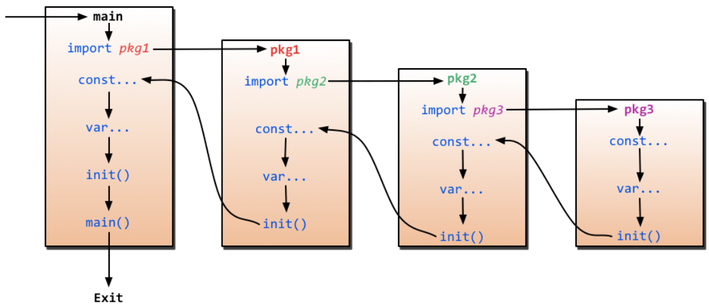

## Go 基础

### init 和 main 函数相关特点

所有 init 函数都在同⼀个 goroutine 内执行。

所有 init 函数结束后才会执行 main.main 函数

<!--more-->

### Go 的数据结构的零值是什么?

所有整型类型：0

浮点类型：0.0

布尔类型：false

字符串类型：””

指针、interface、切片（slice）、channel、map、function ：nil

Go 的零值初始是递归的，即数组、结构体等类型的零值初始化就是对其组成元素逐一进行零值初始化。

### byte 和 rune 有什么区别

rune 和 byte 在 go 语言中都是字符类型，且都是别名类型

byte 型本质上是 uint8 类型的别名，代表了 ASCII 码的一个字符

rune 型本质上是 int32 型的别名，代表一个 UTF-8 字符
