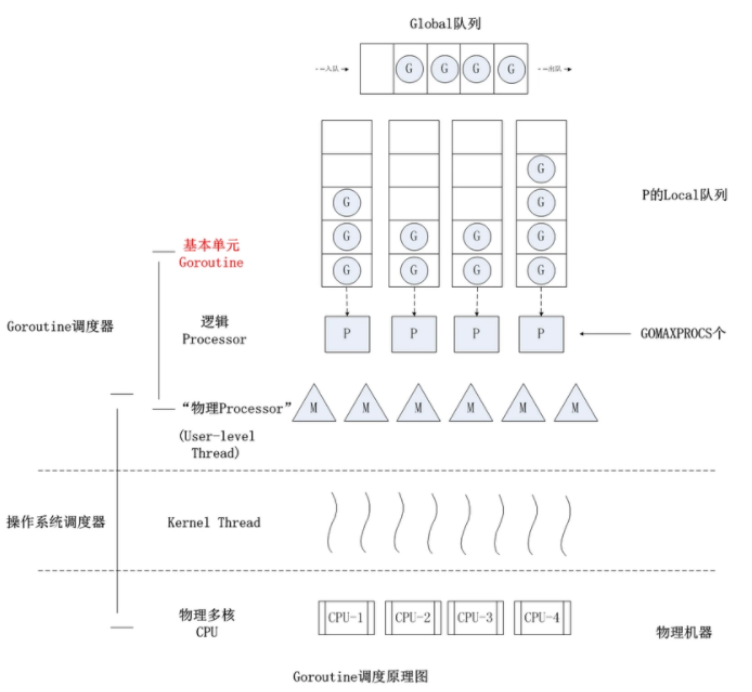

## 为什么选择 Go？

<!--more-->

1. **并发模型**：Go 针对并发做了优化。Go 语言的 goroutine（轻量级线程）和 channel（用于在 goroutine 之间传递数据和同步的机制）使得并发编程更加简单和高效。
2. **静态类型和编译**：Go 是静态类型语言，这意味着在编译时就会发现很多类型错误，而不是在运行时。此外，Go 语言的编译速度非常快，这使得开发过程更加高效。
3. **内置网络库**：Go 语言有强大的内置网络库，包括 http、grpc 等，非常适合开发网络应用和服务端应用。
4. **跨平台**：Go 语言支持跨平台编译，你可以在一种操作系统下编译生成另一种操作系统的可执行程序。
5. **垃圾回收**：Go 语言有垃圾回收功能，并且比 Java 和 Python 更有效。
6. **简洁和清晰的语法**：Go 语言的语法简洁而清晰，易于学习，易于阅读，易于维护。
7. **标准库**：Go 语言拥有丰富的标准库，覆盖了 I/O、文本处理、图像处理、数据库、网络编程、并发编程等许多领域。
8. **工具链**：Go 语言的工具链非常完整，包括用于下载依赖、格式化代码、生成文档、运行测试、编译和安装程序等的工具。
9. **云原生支持**：Go 语言是 Docker 和 Kubernetes 等多个重要的云原生项目的首选语言，对云原生应用有很好的支持。

## Go 基础

### init 和 main 函数相关特点

所有 init 函数都在同⼀个 goroutine 内执行。

所有 init 函数结束后才会执行 main.main 函数


### Go 的数据结构的零值是什么?

所有整型类型：0

浮点类型：0.0

布尔类型：false

字符串类型：””

指针、interface、切片（slice）、channel、map、function ：nil

Go 的零值初始是递归的，即数组、结构体等类型的零值初始化就是对其组成元素逐一进行零值初始化。

### byte 和 rune 有什么区别

rune 和 byte 在 go 语言中都是字符类型，且都是别名类型

byte 型本质上是 uint8 类型的别名，代表了 ASCII 码的一个字符

rune 型本质上是 int32 型的别名，代表一个 UTF-8 字符

## 深入剖析

### 垃圾回收

对程序中不再使用的内存资源进行自动回收的操作。

#### 常见的垃圾回收算法

- 引用计数：每个对象维护一个引用计数，当被引用对象被创建或被赋值给其他对象时引用计数自动加 +1；如果这个对象被销毁，则计数 -1 ，当计数为 0 时，回收该对象。
  - 优点：对象可以很快被回收，不会出现内存耗尽或到达阀值才回收。
  - 缺点：不能很好的处理循环引用
- 标记-清除（Go）：从根变量开始遍历所有引用的对象，引用的对象标记“被引用”，没有被标记的则进行回收。
  - 优点：解决了引用计数的缺点。
  - 缺点：需要 STW（stop the world），暂时停止程序运行。
- 分代收集：按照对象生命周期长短划分不同的代空间，生命周期长的放入老年代，短的放入新生代，不同代有不同的回收算法和回收频率。
  - 优点：回收性能好
  - 缺点：算法复杂

#### 三色标记法（Go）

对象颜色变化的顺序：白 - 灰 - 黑，黑色表示对象已扫描完毕，不会再对黑色对象扫描。

- 初始状态下所有对象都是白色的。
- 从根节点开始遍历所有对象，把遍历到的对象变成灰色对象
- 遍历灰色对象，将灰色对象引用的对象也变成灰色对象，然后将遍历过的灰色对象变成黑色对象。
- 循环步骤 3，直到灰色对象全部变黑色。
- 通过写屏障(write-barrier)检测对象有变化，重复以上操作
- 收集所有白色对象（垃圾）。

#### STW（Stop The World）

- 为了避免在 GC 的过程中，对象之间的引用关系发生新的变更，使得 GC 的结果发生错误（如 GC 过程中新增了一个引用，但是由于未扫描到该引用导致将被引用的对象清除了），停止所有正在运行的协程。
- STW 对性能有一些影响，Golang 目前已经可以做到 1ms 以下的 STW。

#### 写屏障（Write Barrier）

- 为了避免 GC 的过程中新修改的引用关系到 GC 的结果发生错误，我们需要进行 STW。但是 STW 会影响程序的性能，所以我们要通过写屏障技术尽可能地缩短 STW 的时间。

##### 造成引用对象丢失的条件

一个黑色的节点 A 新增了指向白色节点 C 的引用，并且白色节点 C 没有除了 A 之外的其他灰色节点的引用，或者存在但是在 GC 过程中被删除了。以上两个条件需要同时满足：满足条件 1 时说明节点 A 已扫描完毕，A 指向 C 的引用无法再被扫描到；满足条件 2 时说明白色节点 C 无其他灰色节点的引用了，即扫描结束后会被忽略 。

##### 写屏障破坏的两个条件

**破坏条件 1：Dijkstra 写屏障**

满足强三色不变性：黑色节点不允许引用白色节点。当黑色节点新增了白色节点的引用时，将对应的白色节点改为灰色。

**破坏条件 2：Steele / Yuasa 写屏障**

满足弱三色不变性：黑色节点允许引用白色节点，但是该白色节点有其他灰色节点间接的引用（确保不会被遗漏）当白色节点被删除了一个引用时，悲观地认为它一定会被一个黑色节点新增引用，所以将它置为灰色。

#### Golang GC 的缺点

1. **停顿时间**：虽然 Go 语言的垃圾回收器已经做了很多优化，但在进行垃圾回收时，仍然需要暂停程序的执行。这种停顿可能会影响程序的性能，特别是对于实时性要求很高的程序。
2. **内存占用**：垃圾回收需要额外的内存来跟踪哪些对象是活动的，哪些对象是垃圾。这可能会导致程序的内存占用比没有使用垃圾回收的程序更高。
3. **不可预测的性能**：垃圾回收的时间和频率是由运行时环境决定的，不可预测。这可能会导致程序的性能在不同的时间有所波动。
4. **最终性和清理**：Go 的 GC 不提供析构函数或者类似的机制来在对象被回收时执行一些清理工作。这意味着如果你需要在对象被回收时关闭文件、网络连接或者释放其他资源，你需要自己管理这些资源的生命周期。
5. **循环引用**：虽然 Go 的 GC 可以处理循环引用的情况，但如果程序中存在大量的循环引用，可能会使 GC 的工作变得更加复杂，影响性能。

### GPM 调度 和 CSP 模型

#### CSP 模型？

CSP 模型是“以通信的方式来共享内存”，不同于传统的多线程通过共享内存来通信。用于描述两个独立的并发实体通过共享的通讯 channel （管道）进行通信的并发模型。

#### GPM 分别是什么、分别有多少数量？

- G（Goroutine）： 即 Go 协程，每个 go 关键字都会创建一个协程。
- M（Machine）：工作线程，在 Go 中称为 Machine，数量对应真实的 CPU 数（真正干活的对象）。
- P（Processor）：称之为调度器更好，包含运行 Go 代码的必要资源，用来调度 G 和 M 之间的关联关系，其数量可通过 GOMAXPROCS() 来设置，默认为核心数。

M 必须拥有 P 才能执行 G 中的代码，P 有一个包含多个 G 的队列，P 可以调度 G 交由 M 执行。

#### Goroutine 调度策略

- 队列轮转：P 会周期性的将 G 调度到 M 中执行，执行一段时间后，保存上下文，将 G 放到队列尾部，然后从队列中再取出一个 G 进行调度。除此之外，P 还会周期性的查看全局队列是否有 G 等待调度到 M 中执行。
- 系统调用：当 G0 即将进入系统调用时，M0 将释放 P，进而某个空闲的 M1 获取 P，继续执行 P 队列中剩下的 G。M1 的来源有可能是 M 的缓存池，也可能是新建的。
- 当 G0 系统调用结束后，G0 所在的 M0，尝试获取 P 来继续执行 G0。如果有空闲的 P，则获取一个 P，继续执行 G0。如果没有，则将 G0 放入全局队列，等待被其他的 P 调度。然后 M0 将进入缓存池睡眠。



### CHAN 原理

#### 结构体

```go
type hchan struct {
    qcount   uint           // 队列中的总元素个数
    dataqsiz uint           // 环形队列大小，即可存放元素的个数
    buf      unsafe.Pointer // 环形队列指针
    elemsize uint16         //每个元素的大小
    closed   uint32         //标识关闭状态
    elemtype *_type         // 元素类型
    sendx    uint           // 发送索引，元素写入时存放到队列中的位置

    recvx uint  // 接收索引，元素从队列的该位置读出
    recvq waitq // 等待从channel读取消息的goroutine队列
    sendq waitq // 等待将消息写入channel的goroutine队列
    lock  mutex //互斥锁，chan不允许并发读写
}
```

#### 读写流程

##### 向 channel 写数据

1. 当一个 Goroutine 尝试向`channel`写入数据时，首先会检查`channel`的读取队列是否有等待的 Goroutine。如果有，那么写入操作的 Goroutine 会直接将数据传递给读取队列中的一个 Goroutine，然后两者都可以继续执行。
2. 如果读取队列为空，那么写入操作的 Goroutine 会尝试将数据写入`channel`的缓冲区。如果缓冲区已满（对于无缓冲的`channel`，其容量为 0，所以任何写入操作都会被视为"满"），那么写入操作的 Goroutine 会被阻塞，并被添加到`channel`的写入队列中，直到有空间可供写入。
3. 如果缓冲区还有空间，那么写入操作的 Goroutine 会直接将数据写入缓冲区，然后可以继续执行。
4. 若没有空间，则将当前 Goroutine 加入写入队列，等待读唤醒。

##### 从 channel 读数据

1. 当一个 Goroutine 尝试从`channel`读取数据时，首先会检查`channel`的写入队列是否有等待的 Goroutine。如果有，那么读取操作的 Goroutine 会直接从写入队列中的一个 Goroutine 那里接收数据，然后两者都可以继续执行。
2. 如果写入队列为空，那么读取操作的 Goroutine 会尝试从`channel`的缓冲区中读取数据。如果缓冲区为空（对于无缓冲的`channel`，其容量为 0，所以任何读取操作都会被视为"空"），那么读取操作的 Goroutine 会被阻塞，并被添加到`channel`的读取队列中，直到有数据可供读取。
3. 如果缓冲区中有数据，那么读取操作的 Goroutine 会直接从缓冲区中读取数据，然后可以继续执行。
4. 如果没有数据，则将当前 Goroutine 加入读取队列，等待写唤醒。

##### 关闭 channel

1. 当一个 Goroutine 调用`close`函数关闭`channel`时，`channel`的关闭标志会被设置为`true`，表示`channel`已经关闭。
2. 接下来，`channel`的写入队列会被检查。如果写入队列中还有等待的 Goroutines，那么这些 Goroutines 会被唤醒，并接收到一个 panic，因为不能向已经关闭的`channel`写入数据。
3. 然后，`channel`的读取队列会被检查。如果读取队列中有等待的 Goroutines，那么这些 Goroutines 会被唤醒，并接收到`channel`中剩余的数据（如果有）和一个特殊的零值，以及一个表示`channel`已经关闭的`false`布尔值。
4. 对于之后尝试从`channel`读取数据的 Goroutines，它们不会被阻塞，而是立即返回一个零值和一个`false`布尔值，表示`channel`已经关闭。

##### panic 出现的场景

- 关闭值为 nil 的 channel
- 关闭已经关闭的 channel
- 向已经关闭的 channel 中写数据

#### 无缓冲 Chan 的发送和接收是否同步?

```go
// 无缓冲的channel由于没有缓冲发送和接收需要同步
ch := make(chan int)
//有缓冲channel不要求发送和接收操作同步
ch := make(chan int, 2)
```

channel 无缓冲时，发送阻塞直到数据被接收，接收阻塞直到读到数据；channel 有缓冲时，当缓冲满时发送阻塞，当缓冲空时接收阻塞。

### context 结构原理

#### 用途

Context（上下文）是 Golang 应用开发常用的并发控制技术 ，它可以控制一组呈树状结构的 goroutine，每个 goroutine 拥有相同的上下文。Context 是并发安全的，主要是用于控制多个协程之间的协作、取消操作。

```go
type Context interface {
    Deadline() (deadline time.Time, ok bool)
    Done() <-chan struct{}
    Err() error
    Value(key interface{}) interface{}
}
```

- 「Deadline」 方法：可以获取设置的截止时间，返回值 deadline 是截止时间，到了这个时间，Context 会自动发起取消请求，返回值 ok 表示是否设置了截止时间。
- 「Done」 方法：返回一个只读的 channel ，类型为 struct{}。如果这个 chan 可以读取，说明已经发出了取消信号，可以做清理操作，然后退出协程，释放资源。
- 「Err」 方法：返回 Context 被取消的原因。
- 「Value」 方法：获取 Context 上绑定的值，是一个键值对，通过 key 来获取对应的值。
