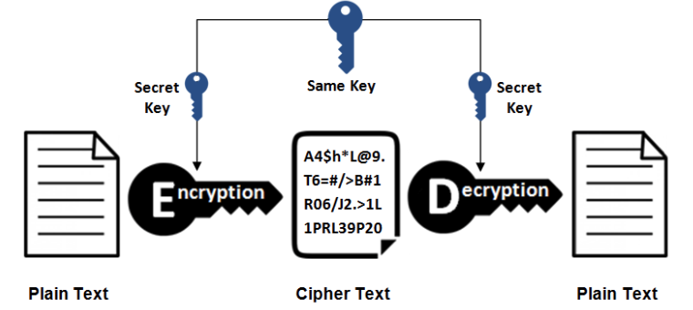
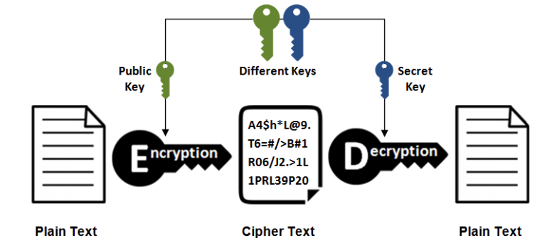

## 一、基础概念

<!--more-->

## 二、HTTP方法

### GET

> 获取资源

当前网络请求中，绝大部分使用的是 GET 方法。

###  POST

> 传输实体主体

POST 主要用来传输数据，而 GET 主要用来获取资源。

### GET和POST的区别

| 特性       | GET                                                       | POST                                                  |
| ---------- | --------------------------------------------------------- | ----------------------------------------------------- |
| 参数位置   | 在URL中，跟在问号后面                                     | 在HTTP请求体中                                        |
| 安全性     | 参数直接暴露在URL中，安全性较低                           | 参数在请求体中，安全性更高                            |
| 数据大小   | 受URL长度限制，数据量较小                                 | 无明显限制，可以传输大量数据                          |
| 幂等性     | 是，无论请求一次还是多次，服务器状态不会改变              | 否，重复的POST请求可能会在服务器上产生不同的结果      |
| 可缓存     | 可以被浏览器或代理服务器缓存                              | 默认情况下不会被缓存                                  |
| 历史/书签  | 请求的URL会被浏览器记录在历史记录中，也可以被添加到书签中 | 请求的URL不会被记录在历史记录中，也不会被添加到书签中 |
| 服务器处理 | 通常用于获取/查询资源信息                                 | 通常用于更新资源信息                                  |

## 六、HTTPS

HTTP有以下安全性问题：

- 使用明文通信，内容可能被窃听；
- 不验证通信方身份，有可能遭遇伪装；
- 无法证明报文完整性，有可能遭篡改。
- 无法防止重放攻击：由于HTTP请求可以被捕获并重放，攻击者可以复制一个用户的操作（如登录、购物等）。

HTTPS 并不是新协议，而是让 HTTP 先和 SSL（Secure Sockets Layer）通信，再由 SSL 和 TCP 通信，也就是说 HTTPS 使用了隧道进行通信。

通过使用 SSL，HTTPS 具有了加密（防窃听）、认证（防伪装）和完整性保护（防篡改）。

| 特性    | HTTP                                     | HTTPS                                                        |
| ------- | ---------------------------------------- | ------------------------------------------------------------ |
| 安全性  | 不安全，数据在传输过程中可以被捕获和查看 | 安全，使用SSL/TLS协议对数据进行加密，防止数据被窃取或篡改    |
| 端口    | 默认使用80端口                           | 默认使用443端口                                              |
| URL显示 | URL前没有特殊标识                        | URL前通常会显示一个小锁图标，表示连接是安全的                |
| 证书    | 不需要证书                               | 需要由受信任的证书颁发机构（CA）签发的SSL/TLS证书            |
| 性能    | 由于不需要进行数据加密，性能较好         | 由于需要进行数据加密，性能可能稍微差一些，但现代硬件和软件优化使得这个差距几乎可以忽略不计 |

### 加密

#### 1. 对称密钥加密

对称密钥加密（Symmetric-Key Encryption），加密和解密使用同一密钥。

- 优点：运算速度快；
- 缺点：无法安全地将密钥传输给通信方。

#### 2.非对称密钥加密

非对称密钥加密，又称公开密钥加密（Public-Key Encryption），加密和解密使用不同的密钥。

公开密钥所有人都可以获得，通信发送方获得接收方的公开密钥之后，就可以使用公开密钥进行加密，接收方收到通信内容后使用私有密钥解密。

非对称密钥除了用来加密，还可以用来进行签名。因为私有密钥无法被其他人获取，因此通信发送方使用其私有密钥进行签名，通信接收方使用发送方的公开密钥对签名进行解密，就能判断这个签名是否正确。

- 优点：可以更安全地将公开密钥传输给通信发送方；
- 缺点：运算速度慢。

#### 3. HTTPS 采用的加密方式

HTTPS 采用混合的加密机制，正是利用了上面提到的方案：

- 使用非对称密钥加密方式，传输对称密钥加密方式所需要的 Secret Key，从而保证安全性;
- 获取到 Secret Key 后，再使用对称密钥加密方式进行通信，从而保证效率。（下图中的 Session Key 就是 Secret Key）

