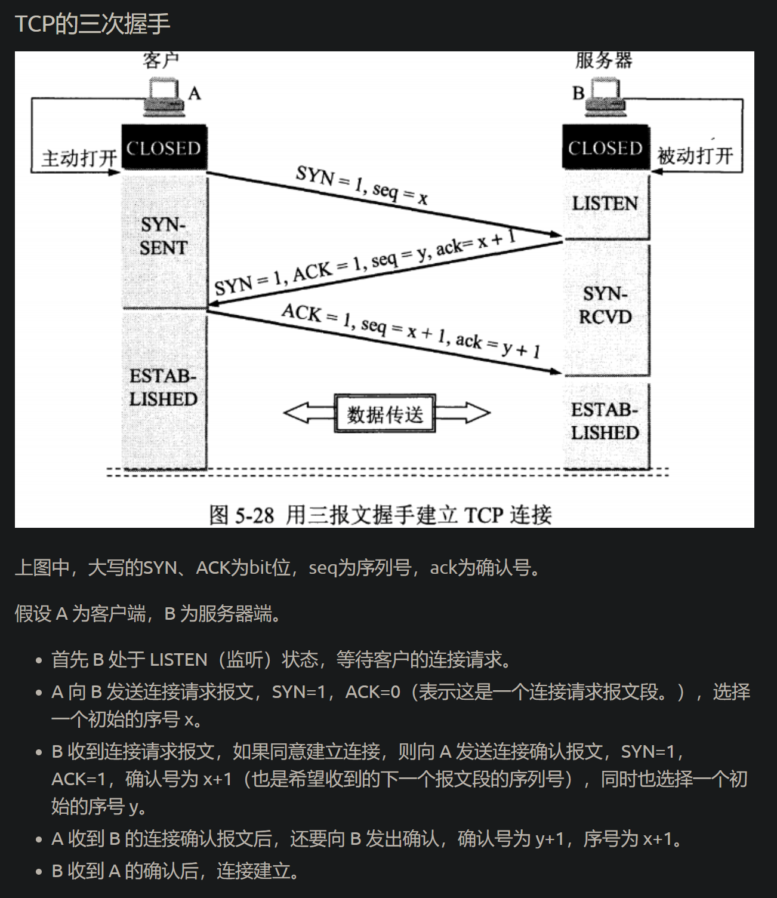
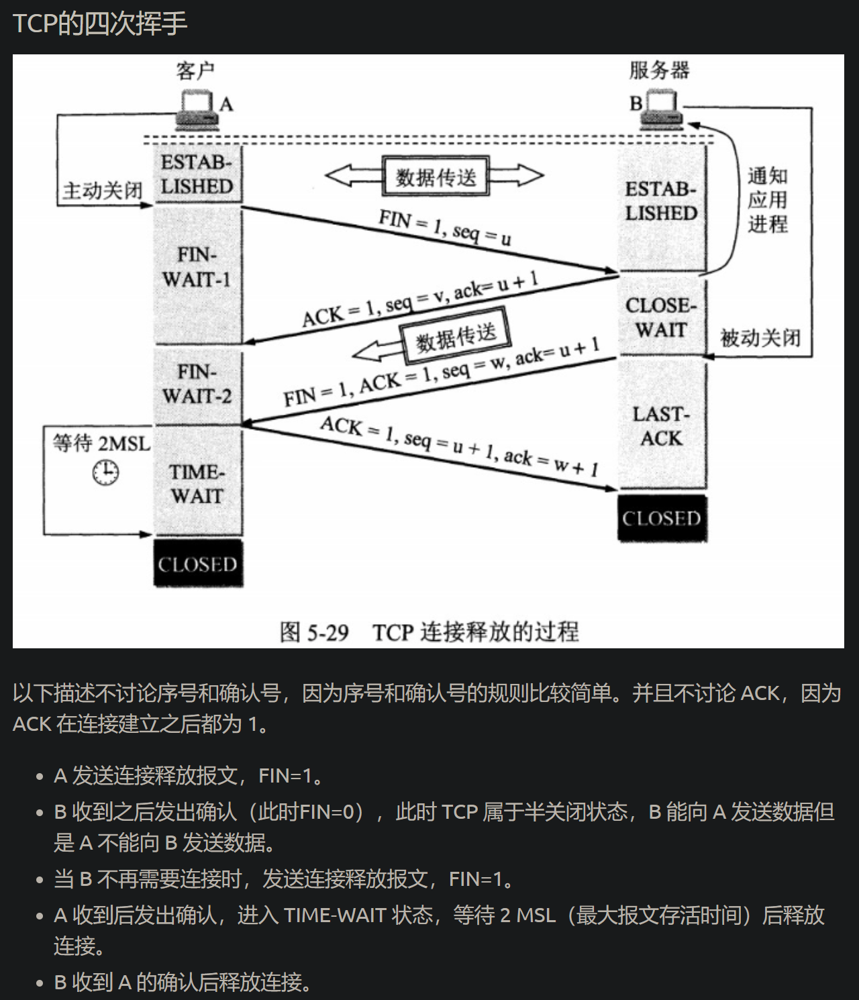
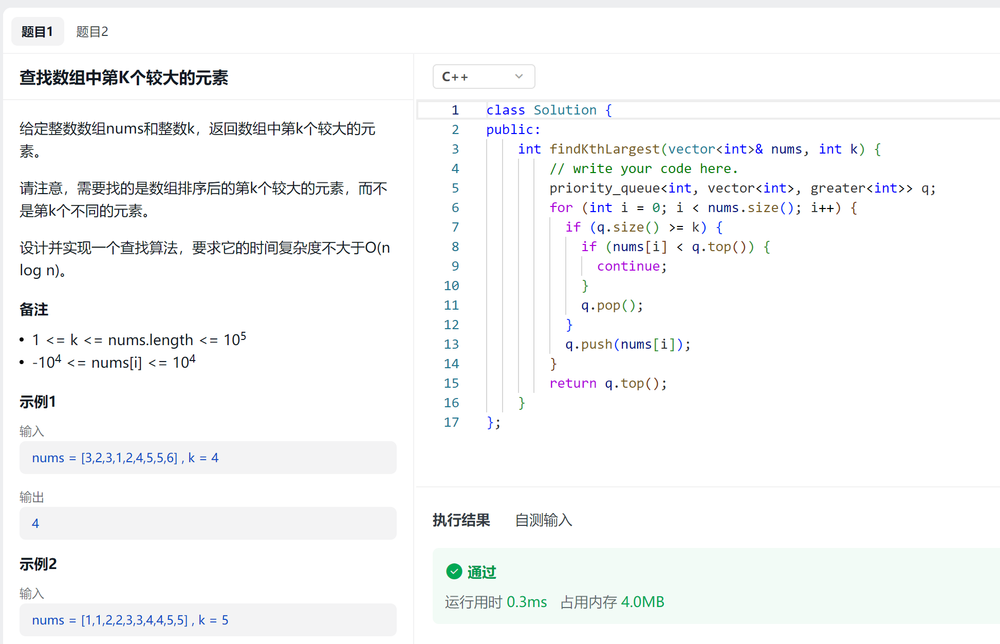

## 前情提要

- 没有针对某个语言，较熟悉的 C++/python。
- 项目都是使用 Go 编写：
  - 二手交易网站
  - IM 即时通信

## 自我介绍

<!--more-->

不必多说。

## 问题

### 二手交易网站中职责有数据库模型的设计与实现，聊天相关的数据库如何设计？

聊天。因为是二手交易，所以没有群聊。两张表，一张存储用户之间的联系，一张存储聊天记录。消息体有一个字段用于区分文字、表情、图片。

### 图片怎么上传？

两个项目不同的处理方式。二手交易网站项目中，将图片转为 blob 的形式存储在 MySQL。IM 即时通信，将图片存储到本地，再将图片的路径存储到 MySQL。

### 数据库记录太多如何处理？肯定会很快变成慢查的。

水平分片，将发送者字段和接收者字段拼接，做哈希映射，避免同一个联系中的聊天记录随机分到不同的片。

### 有没有考虑聊天记录什么时候过期？

没有。（面试官说这也是解决数据库聊天记录太多的方法）。

将常用的查询字段，建索引，解决慢查问题。

### 聊到索引，MySQL 有什么索引？

B+树索引、哈希索引、全文索引、空间索引、覆盖索引。

详细说了一下 B+树索引。

### 还不够？主索引呢？

（这个我不太了解）扯到了聚簇索引和非聚簇索引。在非聚簇索引中找到主键，再去聚簇索引中利用主键找到数据。

### 隔离级别

读未提交、读已提交、可重复读、串行化。

### JWT 鉴权中间件的核心功能实现？

只是调包，不了解底层的实现。

### IM 即时通信如何做到消息不发错对象呢？

实现一个 node 结构体，包含客户端 id，channel 用于传输信息，set 用于存储群聊。建立 map 映射。

服务端为每个客户端开启两个协程，服务端接收的协程很简单，发送的写成需要解析消息体。IM 中的消息体多了一个字段 cmd，用于区分是否为私聊或群聊。如果 cmd 为私聊，直接将消息输发送对象的 channel；如果为群聊，需要遍历 map，查找发送对象是否位于每个节点的 set 中，如果存在，将消息输入该客户端的 channel。

### 为什么用事务添加好友？

防止一方丢失聊天对象。

### 说一下事务的特性

ACID。

原子性：（真该死啊，突然想不起来）事务的操作要么全部提交成功，要么全部失败回滚。

一致性：事务执行前后保持一致性的状态。

隔离性：一个事务在提交之前，对其它事务是不可见的。

持久性：事务一旦提交，修改会永远保存在数据库中。发生崩溃可以用重做日志恢复。

### 你有了解过微信的底层实现吗？

没有。

### 单机可支持数百人聊天，意思是 IM 上线了吗？

没有，最近在服务器部署个人博客。

### InnoDB 的索引和 MyISAM 有什么区别？

| 特性             | InnoDB                                                                                                                                                    | MyISAM                                                                       |
| ---------------- | --------------------------------------------------------------------------------------------------------------------------------------------------------- | ---------------------------------------------------------------------------- |
| 索引类型         | 支持全文索引（MySQL 5.6 及以后版本），支持外键和外键约束                                                                                                  | 支持全文索引，不支持外键和外键约束                                           |
| 索引结构         | 使用聚簇索引，数据按照主键顺序存储。对于主键查询，InnoDB 只需要查找一次（。对于非主键查询，需要在辅助索引上查找到主键，再通过主键在聚簇索引上查找到数据。 | 使用非聚簇索引，数据文件和索引文件是分开的。索引文件只保存了数据记录的地址。 |
| 并发性能         | 支持事务和行级锁定，适合高并发写入                                                                                                                        | 只支持表级锁定，可能在高并发写入场景下成为性能瓶颈                           |
| 数据完整性和恢复 | 支持事务，可以进行崩溃后的恢复，支持外键和参照完整性                                                                                                      | 不支持事务和崩溃后的恢复，系统崩溃后可能需要手动干预修复数据                 |

### http 三次握手

### 四次挥手

## 手撕算法 leetcode 形式

### 第 k 大数，时间复杂度为 O(nlogn)

#### 有想过排序的方法吗？

想过，直接调用 sort，但是时间复杂度是 O(nlong+k)。

查了一下，好像利用快排的思路可以做，在快排过程中，关注点是 index 左边全部小于，右边全部大于，所以，找到 index 为 k/n-k 时的数即可。

### 已知前序遍历和中序遍历，构造二叉树

分治思想，递归构建。

## 聊天环节

### 看到用 c++和 python 解题，学习 python 是兴趣吗？

## 总结

- 要深入了解索引，唯一索引和聚簇索引不同。
- 只是调包 JWT，要了解底层实现。

为什么用go

回收机制并没有比java好

图片如何存储

分布式数据库如何解决？

全局ID？

如果需要扩容，怎么扩容？

怎么保证过程中的可用性？

go的内存对齐

TCP中的time-wait

TCP的`TIME_WAIT`状态是TCP连接关闭过程中的一个正常状态，它有两个主要的目的：

1. **确保最后的ACK报文能被对方收到**：在TCP连接的正常关闭过程中，主动关闭连接的一方（也被称为“主动关闭方”）会发送一个FIN报文来表示它已经完成了数据发送，然后接收一个来自被动关闭方的ACK报文。`TIME_WAIT`状态就是为了等待这个ACK报文的。如果主动关闭方在发送FIN报文后立即关闭连接，它可能会错过这个ACK报文，导致被动关闭方重发FIN报文，从而浪费网络资源。
2. **防止旧的数据报文在网络中滞留**：在网络中，有可能存在滞留的旧数据报文。如果一个新的连接立即复用了旧连接的端口，这些滞留的旧数据报文可能会被误认为是新连接的数据，从而导致错误。`TIME_WAIT`状态可以让主动关闭方等待一段时间（通常是2倍的最大报文生存时间，MMSL），以确保网络中的所有旧数据报文都已经消失。

然而，`TIME_WAIT`状态也可能导致一些问题。如果一个服务器有大量的并发连接，并且这些连接的生命周期都很短，那么服务器可能会有大量的连接处于`TIME_WAIT`状态。这不仅占用了服务器的资源（如端口和内存），而且可能限制了服务器的并发连接能力。为了解决这个问题，一些服务器会使用`SO_REUSEADDR`或`SO_REUSEPORT`选项来允许新连接复用`TIME_WAIT`状态的端口，或者调整`TIME_WAIT`状态的持续时间。

总的来说，`TIME_WAIT`状态是TCP协议设计的一部分，它在保证数据可靠性和防止错误的同时，可能会带来一些资源使用的问题。在实际的网络编程中，我们需要理解和正确处理`TIME_WAIT`状态。

如果发现服务器中存在大量time_wait状态，可能是什么原因导致的呢

大量的`TIME_WAIT`状态通常由以下几种情况造成：

1. **短连接过多**：如果你的应用频繁地创建和关闭TCP连接（例如HTTP/1.0应用），那么你可能会看到大量的`TIME_WAIT`状态。这是因为每个TCP连接在关闭后都会进入`TIME_WAIT`状态，并且会在这个状态中停留一段时间（通常是2倍的最大报文生存时间，MMSL）。如果新的连接创建的速度超过了旧的连接退出`TIME_WAIT`状态的速度，那么`TIME_WAIT`连接的数量就会增加。
2. **服务器主动关闭连接**：在TCP连接的正常关闭过程中，主动关闭连接的一方会进入`TIME_WAIT`状态。如果服务器总是主动关闭连接（例如，服务器在发送完数据后立即关闭连接），那么服务器可能会有大量的`TIME_WAIT`状态。
3. **网络延迟或丢包**：如果网络中存在大量的延迟或丢包，那么TCP连接可能需要更长的时间来完成关闭过程，从而导致更多的`TIME_WAIT`状态。

解决大量`TIME_WAIT`状态的方法可能包括：

- **使用长连接**：如果可能，使用长连接（如HTTP/1.1的Keep-Alive连接或HTTP/2的多路复用连接）可以减少TCP连接的创建和关闭，从而减少`TIME_WAIT`状态。
- **调整`TIME_WAIT`状态的持续时间**：在某些操作系统中，你可以调整`TIME_WAIT`状态的持续时间。但请注意，这可能会影响TCP的可靠性。
- **使用`SO_REUSEADDR`或`SO_REUSEPORT`选项**：这些选项可以让新的连接复用`TIME_WAIT`状态的端口。但请注意，这可能会导致旧的数据报文被误认为是新连接的数据。
- **让客户端主动关闭连接**：在某些情况下，你可以让客户端主动关闭连接，从而把`TIME_WAIT`状态移动到客户端。

这些方法可能需要根据你的具体情况来选择和调整。在实际的网络编程中，理解和正确处理`TIME_WAIT`状态是非常重要的。

索引

abcd

a=1,b=2,c>3,d=4能不能用

以后设计的时候，直接考虑分布式系统
