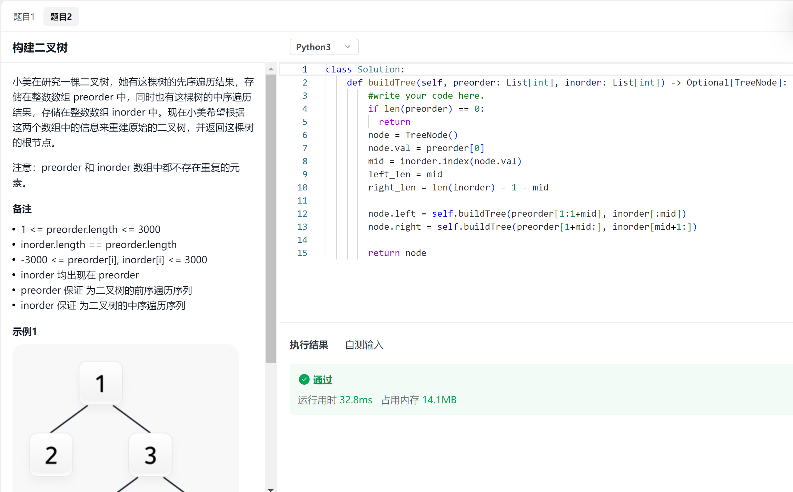

## 自我介绍

## 问题

### 二手交易网站中职责有数据库模型的设计与实现，我的核心部分

聊天。因为是二手交易，所以没有群聊。两张表，一张存储用户之间的联系，一张存储聊天记录。消息体有一个字段用于区分文字、表情、图片。

### 图片怎么上传？

两个项目不同的处理方式。二手交易网站项目中，将图片转为blob的形式存储在MySQL。IM即时通信，将图片存储到本地，再将图片的路径存储到MySQL。

### 数据库记录太多如何处理？肯定会很快变成慢查的。

水平分片，将发送者字段和接收者字段拼接，做哈希映射，避免同一个联系中的聊天记录随机分到不同的片。

### 有没有考虑聊天记录什么时候过期？

没有。（面试官说这也是解决数据库聊天记录太多的方法）。

将常用的查询字段，建索引，解决慢查问题。

### 聊到索引，MySQL有什么索引？

B+树索引、哈希索引、全文索引、空间索引、覆盖索引。

详细说了一下B+树索引。

### 还不够？主索引呢？

（这个我不太了解）扯到了聚簇索引和非聚簇索引。在非聚簇索引中找到主键，再去聚簇索引中利用主键找到数据。

### 隔离级别

读未提交、读已提交、可重复读、串行化。

### JWT鉴权中间件的核心功能实现？

只是调包，不了解底层的实现。

### IM即时通信如何做到消息不发错对象呢？

实现一个node结构体，包含客户端id，channel用于传输信息，set用于存储群聊。建立map映射。

服务端为每个客户端开启两个协程，服务端接收的协程很简单，发送的写成需要解析消息体。IM中的消息体多了一个字段cmd，用于区分是否为私聊或群聊。如果cmd为私聊，直接将消息输发送对象的channel；如果为群聊，需要遍历map，查找发送对象是否位于每个节点的set中，如果存在，将消息输入该客户端的channel。

### 为什么用事务添加好友？

防止一方丢失聊天对象。

### 说一下事务的特性

ACID。

原子性：（真该死啊，突然想不起来）事务的操作要么全部提交成功，要么全部失败回滚。

一致性：事务执行前后保持一致性的状态。

隔离性：一个事务在提交之前，对其它事务是不可见的。

持久性：事务一旦提交，修改会永远保存在数据库中。发生崩溃可以用重做日志恢复。

### 你有了解过微信的底层实现吗？

没有。

### 单机可支持数百人聊天，意思是IM上线了吗？

没有，最近在服务器部署个人博客。

### InnoDB的索引和MyISAM有什么区别？

| 特性             | InnoDB                                                       | MyISAM                                                       |
| ---------------- | ------------------------------------------------------------ | ------------------------------------------------------------ |
| 索引类型         | 支持全文索引（MySQL 5.6 及以后版本），支持外键和外键约束     | 支持全文索引，不支持外键和外键约束                           |
| 索引结构         | 使用聚簇索引，数据按照主键顺序存储。对于主键查询，InnoDB只需要查找一次（。对于非主键查询，需要在辅助索引上查找到主键，再通过主键在聚簇索引上查找到数据。 | 使用非聚簇索引，数据文件和索引文件是分开的。索引文件只保存了数据记录的地址。 |
| 并发性能         | 支持事务和行级锁定，适合高并发写入                           | 只支持表级锁定，可能在高并发写入场景下成为性能瓶颈           |
| 数据完整性和恢复 | 支持事务，可以进行崩溃后的恢复，支持外键和参照完整性         | 不支持事务和崩溃后的恢复，系统崩溃后可能需要手动干预修复数据 |

### http三次握手

### 四次挥手

## 手撕算法 leetcode形式

### 第k大数，时间复杂度为O(nlogn)

#### 有想过排序的方法吗？

想过，直接调用sort，但是时间复杂度是O(nlong+k)。

查了一下，好像利用快排的思路可以做，在快排过程中，关注点是index左边全部小于，右边全部大于，所以，找到index为k/n-k时的数即可。

### 已知前序遍历和中序遍历，构造二叉树

分治思想，递归构建。

## 聊天环节

### 看到用c++和python解题，学习python是兴趣吗？

## 总结

- 要深入了解索引，唯一索引和聚簇索引不同。
- 只是调包JWT，要了解底层实现。
