# 操作系统

转载自：https://github.com/CyC2018/CS-Notes/tree/master

## 概述

### 基本特征

#### 1. 并发

并发指宏观上一段时间内能同时运行多个程序，并行指同一时刻能运行多个指令。

并行需要硬件支持：多流水线、多处理器。

操作系统引入进程和线程，使程序能够并发运行。

<!--more-->

#### 2. 共享

共享指多个进程同时使用系统资源。

两种共享：互斥共享和同时共享。

互斥共享使用的是临界资源，同一时刻只允许一个进程访问，需要用同步机制实现互斥访问。

同步原语：

- 互斥锁
- 信号量
- 条件变量
- 读写锁

#### 3. 虚拟

虚拟技术把一个物理实体转换为多个逻辑实体。

主要有两种虚拟技术：时分复用和空分复用。

多进程在同一个处理器上并发执行使用了时分复用，轮流占用处理器。

虚拟内存使用了空分复用，将物理内存抽象为地址空间，每个进程都有自己的地址空间。

#### 4. 异步

异步指进程不是一次性执行完毕，走走停停。

联想到异步I/O，应用程序执行系统调用会立即返回，可以继续执行，不会被阻塞。内核在完成所有操作后通知应用程序。

### 基本功能

#### 1. 进程管理

进程控制、进程同步、进程通信、死锁处理、处理机调度等。

#### 2. 内存管理

内存分配、地址映射、内存保护与共享、虚拟内存等。

#### 3. 文件管理

文件存储空间的管理、目录管理、文件读写管理和保护。

#### 4. 设备管理

完成用户的 I/O 请求，方便用户使用各种设备，并提高设备的利用率。

主要包括缓冲管理、设备分配、设备处理、虚拟设备等。

### 系统调用

一个进程在用户态要用到内核态的功能，就进行系统调用，从而陷入内核，由操作系统代完成。

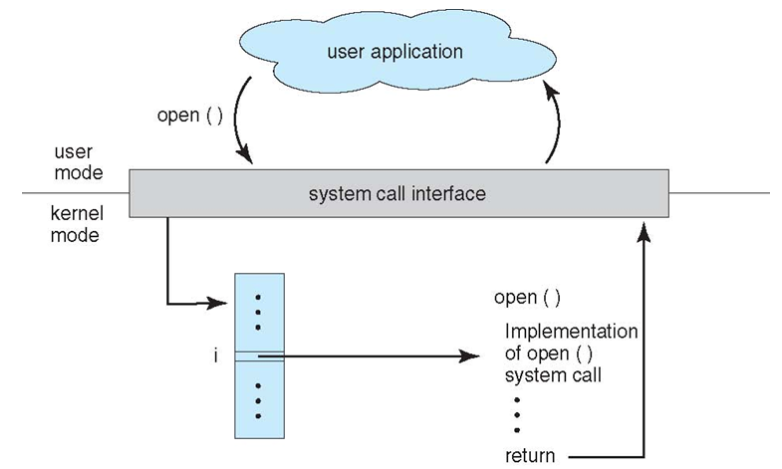

Linux 的系统调用主要有以下这些（暂不了解）：

| Task     | Commands                    |
| -------- | --------------------------- |
| 进程控制 | fork(); exit(); wait();     |
| 进程通信 | pipe(); shmget(); mmap();   |
| 文件操作 | open(); read(); write();    |
| 设备操作 | ioctl(); read(); write();   |
| 信息维护 | getpid(); alarm(); sleep(); |
| 安全     | chmod(); umask(); chown();  |

### 宏内核和微内核

#### 1. 宏内核

将操作系统作为紧密结合的整体放到内核。

由于各模块共享信息，所以性能高。

#### 2. 微内核

将一部分操作系统功能移出内核，降低内核复杂性。移出部分根据分层原则划分为若干服务，相互独立。

只有微内核运行在内核态，其它模块运行在用户态。

频繁在用户态和内核态切换，有一定的性能损失。

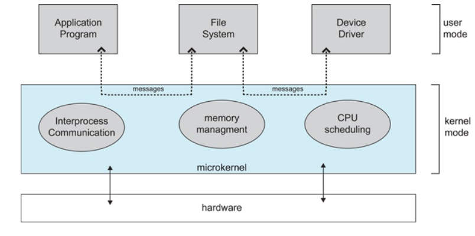

### 中断分类

#### 1. 外中断

由 CPU 执行指令以外的事件引起（表示设备输入/输出处理已经完成，处理器能够发送下一个输入/输出请求），如 I/O 完成中断、时钟中断、控制台中断等。

#### 2. 异常

由 CPU 执行指令的内部事件引起，如非法操作码、地址越界、算术溢出等。

#### 3. 陷入

用户程序使用系统调用。

## 进程管理

### 进程与线程

#### 1. 进程

是资源分配的基本单位。

进程控制块 (Process Control Block, PCB) 描述进程的基本信息和运行状态，所谓的创建进程和撤销进程，都是指对 PCB 的操作。

下图显示了 4 个程序创建了 4 个进程，这 4 个进程可以并发地执行。（时分复用）


#### 2. 线程

是独立调度的基本单位。

一个进程中可以有多个线程，共享进程资源。（互斥共享、同时共享）


浏览器是一个进程，浏览器进程里面有很多线程，例如 HTTP 请求线程、事件响应线程、渲染线程等等，线程的并发执行使得在浏览器中点击一个新链接从而发起 HTTP 请求时，浏览器还可以响应用户的其它事件。

#### 3. 区别

|          | 进程                                                               | 线程                                                                           |
| -------- | ------------------------------------------------------------------ | ------------------------------------------------------------------------------ |
| 拥有资源 | 进程是资源分配的基本单位，拥有独立的资源                           | 线程不拥有资源，可以访问隶属进程的资源                                         |
| 调度     | 进程切换会引起线程切换                                             | 线程是独立调度的基本单位，线程的切换不会引起进程切换（指单个进程中的线程切换） |
| 系统开销 | 创建或撤销进程的开销大，需要分配或回收资源，如内存空间、I/O 设备等 | 创建或撤销线程的开销小，线程切换时只需保存和设置少量寄存器内容                 |
| 通信     | 进程间通信需要借助 IPC                                             | 线程间可以通过直接读写同一进程中的数据进行通信                                 |

### 进程状态的切换


- 就绪（ready）：等待被调度
- 运行（running）
- 阻塞（waiting）：等待资源

注意：

- 只有就绪和运行可以相互转换，其它都是单向。就绪的进程通过调度算法获得 CPU 时间，转为运行；运行用完分配的 CPU 时间，转为就绪。
- 阻塞是运行态缺少资源转换而来，这个资源不包括 CPU 时间。

### 进程调度算法

因地制宜。

#### 1. 批处理系统

没有太多用户操作，目标是保证吞吐量和周转时间。（从**提交**到终止的时间）

##### 1.1 先来先服务 first-come first-served（FCFS）

非抢占式，按请求顺序调度。

不利于短作业，因为要等待前面的长作业执行完毕。

##### 1.2 短作业优先

非抢占，按**估计**运行时间最短调度。

长作业有可能永远得不到调度。

##### 1.3 最短剩余时间有限

短作业优先的**抢占式**版本，按**剩余**运行时间最短的顺序进行调度。新作业到达时，会与当前进程剩余时间比较。如果新进程需要时间更少，则挂起当前进程，运行新的进程（抢占）。

#### 2. 交互式系统

##### 2.1 时间片轮转

所有就绪进程按 FCFS 原则排成队列，CPU 分配时间，轮转执行进程。

效率和时间片的大小相关：

- 时间片太小，导致进程切换频繁，消耗时间。
- 时间片太大，实时性得不到保证。

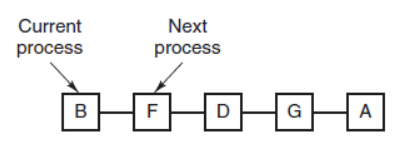

##### 2.2 优先级调度

为每个进程分配优先级，按优先级调度。

为防止低优先级进程等不到调度，可随时间推移增加等待进程的优先级。

##### 2.3 多级反馈队列

一个进程需要执行 100 个时间片，如果采用时间片轮转调度算法，那么需要交换 100 次。

多级队列是为这种需要连续执行多个时间片的进程考虑，它设置了多个队列（依然是时间片轮转），每个队列时间片大小都不同，例如 1,2,4,8,..。进程在第一个队列没执行完，就会被移到下一个队列（降低优先级）。这种方式下，之前的进程只需要交换 7 次。

只有上一个队列没有进程在排队，才能调度当前队列上的进程。

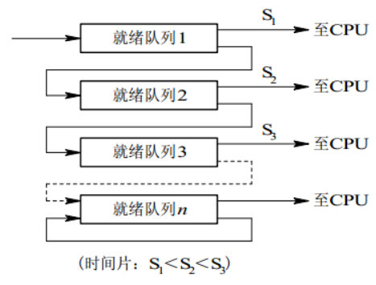

#### 3. 实时系统

要求请求在一个确定时间内得到相应。

分为硬实时（必须满足绝对的截止时间）和软实时（可以容忍一定的超时）。

### 进程同步

#### 1. 临界区（这个词多用于描述多线程）

对临界资源进行访问的代码称为临界区。

为了互斥访问临界资源，每个进程在进入临界区之前，需要先进行检查。

```
// entry section
// critical section; 只有这一部分是临界区
// exit section
```

#### 2. 同步与互斥

- 同步：多进程因合作产生的直接制约关系，使进程有一定的先后执行顺序。
- 互斥：多进程在同一时刻只能有一个进程进入临界区。

#### 3. 信号量

信号量（Semaphore）是一个整型变量，可以对其执行 down 和 up 操作，也就是常见的 P 和 V 操作。

- **down** : 如果信号量大于 0 ，执行 -1 操作；如果信号量等于 0，进程睡眠，等待信号量大于 0（此时还未进入临界区）；
- **up** ：对信号量执行 +1 操作，唤醒睡眠的进程让其完成 down 操作。

down 和 up 操作需要被设计成原语，不可分割，通常的做法是在执行这些操作的时候屏蔽中断。

如果信号量的取值只能为 0 或者 1，那么就成为了 **互斥量（Mutex）** ，0 表示临界区已经加锁，1 表示临界区解锁。

```
typedef int semaphore;
semaphore mutex = 1;
void P1() {
    down(&mutex);
    // 临界区
    up(&mutex);
}

void P2() {
    down(&mutex);
    // 临界区
    up(&mutex);
}
```

**使用信号量实现生产者-消费者问题**

问题描述：使用一个缓冲区来保存物品，只有缓冲区没有满，生产者才可以放入物品；只有缓冲区不为空，消费者才可以拿走物品。

因为缓冲区属于临界资源，因此需要使用一个互斥量 mutex 来控制对缓冲区的互斥访问。

为了同步生产者和消费者的行为，需要记录缓冲区中物品的数量。数量可以使用信号量来进行统计，这里需要使用两个信号量：empty 记录空缓冲区的数量，full 记录满缓冲区的数量。其中，empty 信号量是在生产者进程中使用，当 empty 不为 0 时，生产者才可以放入物品；full 信号量是在消费者进程中使用，当 full 信号量不为 0 时，消费者才可以取走物品。

注意，不能先对缓冲区进行加锁，再测试信号量。也就是说，不能先执行 down(mutex) 再执行 down(empty)。如果这么做了，那么可能会出现这种情况：生产者对缓冲区加锁后，执行 down(empty) 操作，发现 empty = 0，此时生产者睡眠。消费者不能进入临界区，因为生产者对缓冲区加锁了，消费者就无法执行 up(empty) 操作，empty 永远都为 0，导致生产者永远等待下，不会释放锁，消费者因此也会永远等待下去。

```
#define N 100
typedef int semaphore;
semaphore mutex = 1;
semaphore empty = N;
semaphore full = 0;

void producer() {
    while(TRUE) {
        int item = produce_item();
        down(&empty); // 注意，empty和mutex的顺序不能颠倒
        down(&mutex);
        insert_item(item);
        up(&mutex);
        up(&full);
    }
}

void consumer() {
    while(TRUE) {
        down(&full);
        down(&mutex);
        int item = remove_item();
        consume_item(item);
        up(&mutex);
        up(&empty);
    }
}
```

#### 4. 管程

信号量机制需要客户端代码做很多控制，管程把控制的代码独立出来，客户端只需要调用方法。

一个时刻只能有一个进程使用管程。进程无法执行时不能一直占用管程。

管程引入了 **条件变量** 以及相关的操作：**wait()** 和 **signal()** 来实现同步操作。对条件变量执行 wait() 操作会导致调用进程阻塞，把管程让出来给另一个进程持有。signal() 操作用于唤醒被阻塞的进程。

### 经典同步问题

#### 1. 哲学家进餐问题


五个哲学家围着一张圆桌，每个哲学家面前放着食物。哲学家的生活有两种交替活动：吃饭以及思考。当一个哲学家吃饭时，需要先拿起自己左右两边的两根筷子，并且一次只能拿起一根筷子。

为了防止死锁：

- 必须同时拿起左右两根筷子；
- 只有在两个邻居都没有进餐的情况下才允许进餐。

#### 2. 读者-写者问题

允许多进程同时对数据进行读操作，不能同时读写，也不能同时写。

一个整型变量 count 记录在对数据进行读操作的进程数量，一个互斥量 count_mutex 用于对 count 加锁，一个互斥量 data_mutex 用于对读写的数据加锁。

写者只需要使用 data_mutex 对写的数据加锁。

### 进程通信

进程同步和进程通信的区别：

- 同步：控制多进程按一定顺序执行。
- 通信：进程间传输消息。

通信是手段，同步是目的。为了能够达到进程同步的目的，需要让进程进行通信，传输一些进程同步所需要的信息。

#### 1. 管道

- 半双工通信。
- 只能在父子进程或兄弟进程中使用。

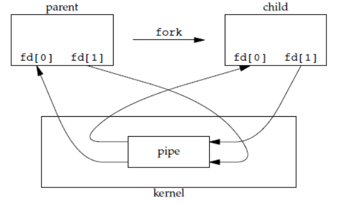

#### 2. FIFO

命名管道，去除了管道只能在父子进程中使用的限制。

常用于 C-S 中。

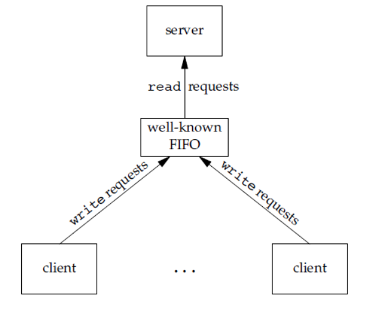

#### 3. 消息队列

相比于 FIFO，消息队列具有以下优点：

- 消息队列可以独立于读写进程存在（作为一个独立的实体存在，不依赖于创建它的进程），从而避免了 FIFO 中同步管道的打开和关闭时可能产生的困难；
- 避免了 FIFO 的同步阻塞问题（进程可以立即返回并执行其他操作，而不是等待队列可以执行。发送者可以快速地把消息放入队列然后继续执行其他任务，而不需要等待接收者处理消息），不需要进程自己提供同步方法；
- 读进程可以根据消息类型有选择地接收消息（如只接收优先级最高的消息），而不像 FIFO 那样只能默认地接收（严格按照写入的顺序）。

#### 4. 信号量

计数器。

在进程间通信的情境下，信号量可以用来传递信息或者是信号。一个进程可以通过增加信号量值来向其他进程发送一个信号，其他进程可以通过检查信号量值来接收这个信号。

和进程同步中的信号量是同一种机制，但是使用方式和目的有所不同。

#### 5. 共享存储

允许多个进程共享一个给定的存储区。这是最快的一种 IPC。

需要用信号量来同步对共享存储的访问。

#### 6. 套接字

可用于不同机器间的进程通信。

## 死锁

### 必要条件

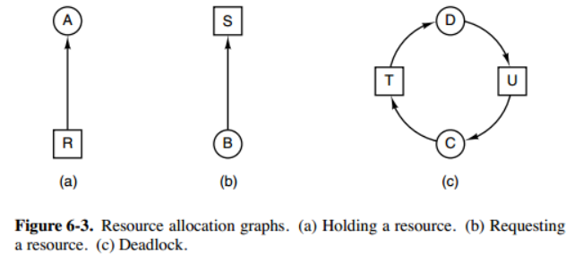

- 互斥：资源要么被分配给一个进程，要么可用。
- 占有和等待：已得到某个资源的进程，可以继续请求新的资源。
- 不可抢占：资源只能被占有它的进程显式释放。
- 环路等待：两个及以上的进程组成环路，该环路中每个进程都在等待下一个进程占有的资源。

### 处理方法

主要有四种：

- 鸵鸟策略
- 死锁检测与死锁恢复
- 死锁预防
- 死锁避免

### 鸵鸟策略

锁了就是锁了？假装根本没发生死锁。

解决死锁代价很高，这种方案会获得很高的性能。

当死锁对用户不会造成多大的影响，或死锁发生的概率很低时，可采取。

大多数操作系统，包括 Unix，Linux 和 Windows，处理死锁问题的办法仅仅是忽略它。

### 死锁检测与死锁恢复

不阻止，检测到死锁发生时，采取措施恢复。

#### 1. 每种类型一个资源的死锁检测

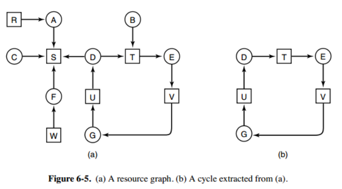

圆圈表示进程，方框表示资源。进程指向资源表示进程请求获取该资源，反之表示进程已经占有该资源。

图 a 可以抽取出环，如图 b，它满足了环路等待条件，因此会发生死锁。

每种类型**一个资源**的死锁检测算法是通过检测**有向图是否存在环**来实现，从一个节点出发进行 dfs，对访问过的节点进行标记，如果访问了已经标记的节点，就表示有向图存在环，也就是检测到死锁的发生。

#### 2. 每种类型多个资源的死锁检测

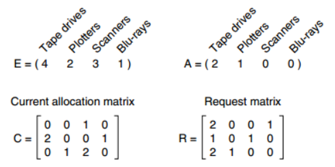

上图中，有三个进程四个资源，每个数据代表的含义如下：

- E 向量：资源总量
- A 向量：资源剩余量
- C 矩阵：每个进程所拥有的资源数量，每一行都代表一个进程拥有资源的数量
- R 矩阵：每个进程请求的资源数量

进程 P1 和 P2 所请求的资源都得不到满足，只有进程 P3 可以，让 P3 执行，之后释放 P3 拥有的资源，此时 A = (2 2 2 0)。P2 可以执行，执行后释放 P2 拥有的资源，A = (4 2 2 1) 。P1 也可以执行。所有进程都可以顺利执行，没有死锁。

```
初始化所有进程为未标记状态
设置 A 为可用资源

while 存在未标记的进程 Pi，其所请求的资源小于等于 A do
    将 C 矩阵的第 i 行向量加到 A
    标记进程 Pi
end while

检查所有进程，如果存在未被标记的进程，则标记为死锁进程
```

#### 3. 死锁恢复

- 抢占恢复
- 回滚恢复
- 杀死进程恢复

### 死锁预防

程序运行**之前**预防发生死锁，即破坏发生死锁的四个条件。

#### 1. 破坏互斥条件（最难破坏，也有可能无法破坏）

例如假脱机打印机技术允许若干个进程同时输出，唯一真正请求物理打印机的进程是打印机守护进程。

#### 2. 破坏占有和等待条件

一种实现方式是规定所有进程在开始执行前请求所需要的全部资源。

#### 3. 破坏不可抢占条件

#### 4. 破坏环路等待

给资源统一编号，进程只能按编号顺序来请求资源。

### 死锁避免

程序**运行时**避免发生死锁。（死锁避免其实就是用死锁检测的方法，先检测如果执行了请求，未来的状态是否会发生死锁，然后避免）

#### 1. 安全状态


图 a 的第二列 Has 表示已拥有的资源数，第三列 Max 表示总共需要的资源数，Free 表示还有可以使用的资源数。从图 a 开始出发，先让 B 拥有所需的所有资源（图 b），运行结束后释放 B，此时 Free 变为 5（图 c）；接着以同样的方式运行 C 和 A，使得所有进程都能成功运行，因此可以称图 a 所示的状态时安全的。

定义：如果没有死锁发生，并且即使所有进程突然请求对资源的最大需求，也仍然存在某种调度次序能够使得每一个进程运行完毕，则称该状态是安全的。

安全状态的检测与死锁的检测类似，因为安全状态必须要求不能发生死锁。下面的银行家算法与死锁检测算法非常类似，可以结合着做参考对比。

#### 2. 单个资源的银行家算法

一个小城镇的银行家，他向一群客户分别承诺了一定的贷款额度，算法要做的是判断对请求的满足是否会进入不安全状态，如果是，就拒绝请求；否则予以分配。

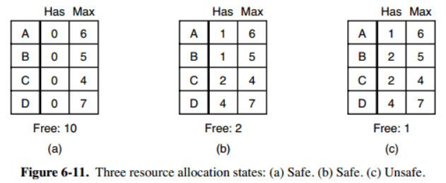

上图 c 为不安全状态，因此算法会拒绝之前的请求，从而避免进入图 c 中的状态。

#### 3. 多个资源的银行家算法

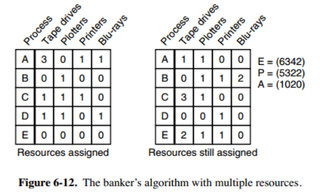

上图中有五个进程，四个资源。左边的图表示已经分配的资源，右边的图表示还需要分配的资源。最右边的 E、P 以及 A 分别表示：总资源、已分配资源以及可用资源，注意这三个为向量，而不是具体数值，例如 A=(1020)，表示 4 个资源分别还剩下 1/0/2/0。

检查一个状态是否安全的算法如下：

- 查找右边的矩阵是否存在一行小于等于向量 A。如果不存在这样的行，那么系统将会发生死锁，状态是不安全的。
- 假若找到这样一行，将该进程标记为终止，并将其已分配资源加到 A 中。
- 重复以上两步，直到所有进程都标记为终止，则状态时安全的。

如果一个状态不是安全的，需要拒绝进入这个状态。

## 内存管理

### 虚拟内存

虚拟内存的目的是为了让物理内存扩充成更大的逻辑内存，从而让程序获得更多的可用内存。

为了更好的管理内存，操作系统将内存抽象成地址空间。每个程序拥有自己的地址空间，这个地址空间被分割成多个块，每一块称为一页。这些页被映射到物理内存，但不需要映射到连续的物理内存，也不需要所有页都必须在物理内存中。当程序引用到不在物理内存中的页时，由硬件执行必要的映射，将缺失的部分装入物理内存并重新执行失败的指令。

从上面的描述中可以看出，虚拟内存允许程序不用将地址空间中的每一页都映射到物理内存，也就是说一个程序不需要全部调入内存就可以运行，这使得有限的内存运行大程序成为可能。例如有一台计算机可以产生 16 位地址，那么一个程序的地址空间范围是 0~64K。该计算机只有 32KB 的物理内存，虚拟内存技术允许该计算机运行一个 64K 大小的程序。

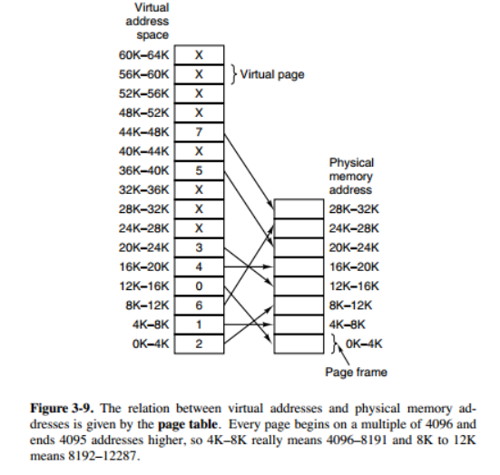

### 分页系统地址映射

内存管理单元（MMU）管理着地址空间和物理内存的转换，其中的页表（Page table）存储着页（程序地址空间）和页框（物理内存空间）的映射表。

一个虚拟地址分成两个部分，一部分存储页面号，一部分存储偏移量。

下图的页表存放着 16 个页，这 16 个页需要用 4 个比特位来进行索引定位。例如对于**虚拟**地址（0010 000000000100），前 4 位是存储页面号 2，读取表项内容为（110 1），页表项最后一位表示是否存在于内存中，1 表示存在。后 12 位存储偏移量。这个页对应的**页框**的地址为 （110 000000000100）。少了一位。

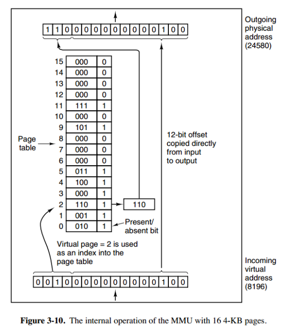

### 页面置换算法

在程序运行过程中，如果要访问的页面不在内存中，就发生缺页中断从而将该页调入内存中。此时如果内存已无空闲空间，系统必须从内存中调出一个页面到磁盘对换区中来腾出空间。

页面置换算法和缓存淘汰策略类似，可以将内存看成磁盘的缓存。在缓存系统中，缓存的大小有限，当有新的缓存到达时，需要淘汰一部分已经存在的缓存，这样才有空间存放新的缓存数据。

页面置换算法的主要目标是使页面置换频率最低（也可以说缺页率最低）。

#### 1. 最佳

> OPT, Optimal replacement algorithm

所选择的被换出的页面将是最长时间内不再被访问，通常可以保证获得最低的缺页率。

是一种理论上的算法，因为无法知道一个页面多长时间（未来的时间）不再被访问。

举例：一个系统为某进程分配了三个物理块，并有如下页面引用序列：

```
7，0，1，2，0，3，0，4，2，3，0，3，2，1，2，0，1，7，0，1
```

开始运行时，先将 7, 0, 1 三个页面装入内存。当进程要访问页面 2 时，产生缺页中断，会将页面 7 换出，看后续页面，7, 0, 1 出现的先后顺序为 0, 1, 7，即页面 7 再次被访问的时间最长。

#### 2. 最近最久未使用

> LRU, Least Recently Used

虽然无法知道将来要使用的页面情况，但是可以知道过去使用页面的情况。LRU 将最近最久未使用的页面换出。

为了实现 LRU，需要在内存中维护一个所有页面的链表。当一个页面被访问时，将这个页面移到链表表头。这样就能保证链表表尾的页面是最近最久未访问的。

因为每次访问都需要更新链表，因此这种方式实现的 LRU 代价很高。

```
4，7，0，7，1，0，1，2，1，2，6
```

下图中最后一个才涉及到页面置换，最久未使用的 4 被移出。


#### 3. 最近未使用

> NRU, Not Recently Used

每个页面都有两个状态位：R 与 M，当页面被访问时设置页面的 R=1，当页面被修改时设置 M=1。其中 R 位会定时被清零。可以将页面分成以下四类：

- R=0，M=0
- R=0，M=1
- R=1，M=0
- R=1，M=1

当发生缺页中断时，NRU 算法随机地从类编号最小的非空类中挑选一个页面将它换出。

NRU 优先换出**已经被修改的脏页面**（R=0，M=1），而不是被频繁使用的干净页面（R=1，M=0）。

#### 4. 先进先出

> FIFO, First In First Out

选择换出的页面是最先进入的页面。

该算法会将那些经常被访问的页面换出，导致缺页率升高。

#### 5. 第二次机会算法

FIFO 算法可能会把经常使用的页面置换出去，为了避免这一问题，对该算法做一个简单的修改：

当页面被访问 (读或写) 时设置该页面的 R 位为 1（说明该页面之前被访问过，获得了复活甲，R = 1）。需要替换的时候，检查最老页面的 R 位。如果 R 位是 0，那么这个页面既老又没有被使用，可以立刻置换掉；如果是 1，就将 R 位清 0（复活甲掉了），并把该页面放到链表的尾端，修改它的装入时间使它就像刚装入的一样，然后继续从链表的头部开始搜索。

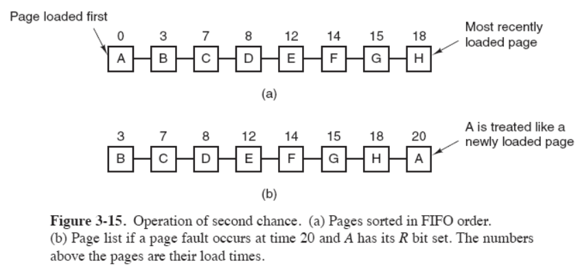

#### 6. 时钟

> Clock

第二次机会算法需要在链表中移动页面，降低了效率。时钟算法使用环形链表将页面连接起来，再使用一个指针指向最老的页面。

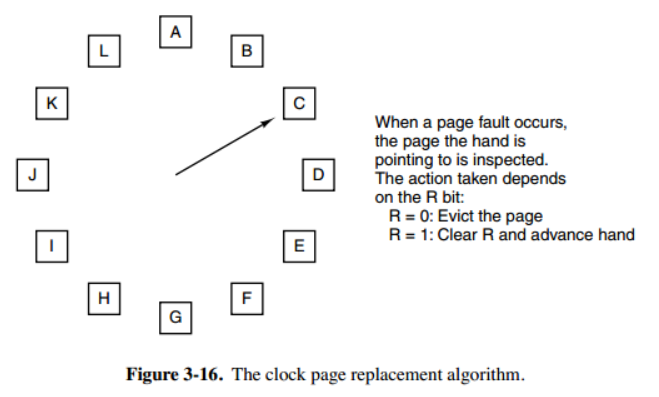

### 分段（暂无）
