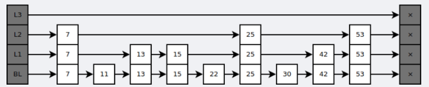

redis

概述

NoSQL 主要存储键值和五种不同类型的值之间的映射。

## 二、数据类型

| 数据类型 |      可以存储的值      |                             操作                             |
| :------: | :--------------------: | :----------------------------------------------------------: |
|  STRING  | 字符串、整数或者浮点数 | 对整个字符串或者字符串的其中一部分执行操作、对整数浮点数执行自增或者自减操作 |
|   LIST   |          列表          | 从两端压入或者弹出元素、对单个或者多个元素进行修剪、只保留一个范围内的元素 |
|   SET    |        无序集合        | 添加、获取、移除单个元素、检查一个元素是否存在于集合中、计算交集、并集、差集、从集合里面随机获取元素 |
|   HASH   | 包含键值对的无序散列表 | 添加、获取、移除单个键值对、获取所有键值对、检查某个键是否存在 |
|   ZSET   |        有序集合        | 添加、获取、删除元素、根据分值范围或者成员来获取元素、计算一个键的排名 |

### STRING


```shell
> set hello world
OK
> get hello
"world"
> del hello
(integer) 1
> get hello
(nil)
```

###  LIST


list的返回值integer为list长度。

```shell
> rpush list-key item 
(integer) 1
> rpush list-key item2
(integer) 2
> rpush list-key item
(integer) 3

> lrange list-key 0 -1
1) "item"
2) "item2"
3) "item"

> lindex list-key 1
"item2"

> lpop list-key
"item"

> lrange list-key 0 -1
1) "item2"
2) "item"
```

### SET


set中的integer指的是成功操作的数量。

```shell
> sadd set-key item
(integer) 1
> sadd set-key item2
(integer) 1
> sadd set-key item3
(integer) 1
> sadd set-key item
(integer) 0

> smembers set-key
1) "item"
2) "item2"
3) "item3"

> sismember set-key item4
(integer) 0
> sismember set-key item
(integer) 1

> srem set-key item2
(integer) 1
> srem set-key item2
(integer) 0

> smembers set-key
1) "item"
2) "item3"
```

### HASH


hgetall依次返回键值对

```shell
> hset hash-key sub-key1 value1
(integer) 1
> hset hash-key sub-key2 value2
(integer) 1
> hset hash-key sub-key1 value1
(integer) 0

> hgetall hash-key
1) "sub-key1"
2) "value1"
3) "sub-key2"
4) "value2"

> hdel hash-key sub-key2
(integer) 1
> hdel hash-key sub-key2
(integer) 0

> hget hash-key sub-key1
"value1"

> hgetall hash-key
1) "sub-key1"
2) "value1"
```

### ZSET


```shell
> zadd zset-key 728 member1
(integer) 1
> zadd zset-key 982 member0
(integer) 1
> zadd zset-key 982 member0
(integer) 0

> zrange zset-key 0 -1 withscores
1) "member1"
2) "728"
3) "member0"
4) "982"

> zrangebyscore zset-key 0 800 withscores
1) "member1"
2) "728"

> zrem zset-key member1
(integer) 1
> zrem zset-key member1
(integer) 0

> zrange zset-key 0 -1 withscores
1) "member0"
2) "982"
```

##  三、数据结构

### 字典

Redis的哈希表实现使用了一种叫做"渐进式rehash"的技术。当Redis的哈希表需要扩容或者缩容时，它并不会一次性地将所有的键值对重新哈希到新的哈希表中，而是分多次、渐进地完成这一任务。

以下是Redis渐进式rehash的基本步骤：

1. **分配新哈希表**：当哈希表需要扩容或缩容时，Redis首先会创建一个新的哈希表。新哈希表的大小通常是当前哈希表大小的两倍（扩容）或者当前哈希表大小的一半（缩容）。
2. **渐进式迁移**：每次Redis对哈希表执行添加、删除或查找等操作时，它会顺带地将旧哈希表中的一部分键值对重新哈希到新的哈希表中。这一步是渐进式rehash的核心，通过分摊在每个操作中，避免了一次性rehash带来的大量计算。
3. **切换到新哈希表**：当所有的键值对都被迁移到新的哈希表中后，Redis会释放旧的哈希表，并开始使用新的哈希表。

这种渐进式rehash的方法可以确保即使在哈希表需要进行rehash的时候，Redis仍然能够保持高性能，因为rehash的工作被分摊在了多个操作中，而不是一次性完成。但是，这种方法也会使得rehash过程持续一段时间，具体的时间取决于哈希表的大小和Redis操作的频率。

需要注意的是，虽然Redis使用了渐进式rehash，但是在rehash期间，新旧两个哈希表会同时存在，因此会暂时使用更多的内存。如果内存资源非常紧张，可能需要考虑其他的策略，例如，可以在Redis的空闲时段，例如夜间，手动触发rehash操作。

### 跳跃表

是有序集合的底层实现之一。

跳跃表是基于多指针有序链表实现的，可以看成多个有序链表。



在查找时，从上层指针开始查找，找到对应的区间之后再到下一层去查找。下图演示了查找 22 的过程。


与红黑树等平衡树相比，跳跃表具有以下优点：

- 插入速度非常快速，因为不需要进行旋转等操作来维护平衡性；
- 更容易实现；
- 支持无锁操作。

## 四、使用场景

### 计数器

可以对 String 进行自增自减运算，从而实现计数器功能。

Redis 这种内存型数据库的读写性能非常高，很适合存储频繁读写的计数量。

### 缓存

将热点数据放到内存中，设置内存的最大使用量以及淘汰策略来保证缓存的命中率。

### 查找表

例如 DNS 记录就很适合使用 Redis 进行存储。

查找表和缓存类似，也是利用了 Redis 快速的查找特性。但是查找表的内容不能失效，而缓存的内容可以失效，因为缓存不作为可靠的数据来源。

### 消息队列

最好使用 Kafka、RabbitMQ 等消息中间件。

### 分布式锁实现

在分布式场景下，无法使用单机环境下的锁来对多个节点上的进程进行同步。

可以使用 Redis 自带的 SETNX 命令实现分布式锁，除此之外，还可以使用官方提供的 RedLock 分布式锁实现。

1. **SETNX命令**：`SETNX`命令的全称是"SET if Not eXists"，它接受两个参数，一个是键，一个是值。如果键不存在，`SETNX`将键的值设为指定的值，并返回1。如果键已经存在，`SETNX`不做任何操作，并返回0。因此，可以使用`SETNX`命令来尝试获取一个锁，键是锁的名称，值可以是一个标识符，用来标识获取锁的节点。如果`SETNX`返回1，说明成功获取到锁，如果返回0，说明锁已经被其他节点获取。
2. **RedLock算法**：RedLock是Redis官方提出的一个分布式锁的算法。与`SETNX`不同，RedLock可以在多个Redis实例之间实现真正的分布式锁。RedLock算法的基本思想是，从N个Redis实例中尝试获取锁，只有当超过N/2个Redis实例成功获取到锁时，才认为成功获取到分布式锁。

这些锁是在Redis的数据结构中实现的，具体来说，就是在Redis的键值对中。当一个节点尝试获取锁时，它实际上是在尝试在Redis中创建一个特定的键，如果创建成功，说明该节点成功获取到了锁；如果创建失败，说明锁已经被其他节点获取。当一个节点完成了对共享资源的操作后，它需要删除Redis中对应的键，以释放锁，让其他节点可以获取锁。

### 其它

Set 可以实现交集、并集等操作，从而实现共同好友等功能。

ZSet 可以实现有序性操作，从而实现排行榜等功能。

## 五、Redis 与 Memcached

| 特性       | Redis                                                        | Memcached                                                    |
| ---------- | ------------------------------------------------------------ | ------------------------------------------------------------ |
| 数据类型   | 支持字符串、列表、集合、有序集合和哈希表等多种数据类型       | 仅支持简单的键值对，值通常是字符串                           |
| 数据持久化 | 支持RDB和AOF两种持久化策略，可以定期或者根据数据更新频率将数据写入磁盘 | 不支持持久化，数据存储在内存中，如果服务器关闭，数据会丢失   |
| 分布式支持 | Redis Cluster支持分布式，可以实现数据的分片存储              | 本身不支持分布式，但可以在客户端使用一致性哈希等技术实现分布式存储 |
| 内存管理   | Redis使用了一种称为LRU（Least Recently Used，最近最少使用）的策略来淘汰旧的数据，可以将一些很久没用的value交换到磁盘 | Memcached将内存划分为固定大小的块来存储数据，每个块内存不足的部分会被浪费 |
| 应用场景   | 适用于需要持久化和高性能的场景，以及需要利用其丰富数据类型进行复杂计算的场景 | 适用于简单的缓存场景，以及对数据持久化要求不高，但需要快速访问的场景 |

## 六、键的过期时间

Redis 可以为每个键设置过期时间，当键过期时，会自动删除该键。

对于散列表这种容器，只能为整个键设置过期时间（整个散列表），而不能为键里面的单个元素设置过期时间。

## 七、数据淘汰策略

可以设置内存最大使用量，当内存使用量超出时，会施行数据淘汰策略。

Redis 具体有 6 种淘汰策略：

|      策略       |                         描述                         |
| :-------------: | :--------------------------------------------------: |
|  volatile-lru   | 从已设置过期时间的数据集中挑选最近最少使用的数据淘汰 |
|  volatile-ttl   |   从已设置过期时间的数据集中挑选将要过期的数据淘汰   |
| volatile-random |      从已设置过期时间的数据集中任意选择数据淘汰      |
|   allkeys-lru   |       从所有数据集中挑选最近最少使用的数据淘汰       |
| allkeys-random  |          从所有数据集中任意选择数据进行淘汰          |
|   noeviction    |                     禁止驱逐数据                     |

作为内存数据库，出于对性能和内存消耗的考虑，Redis 的淘汰算法实际实现上并非针对所有 key，而是抽样一小部分并且从中选出被淘汰的 key。

使用 Redis 缓存数据时，为了提高缓存命中率，需要保证缓存数据都是热点数据。可以将内存最大使用量设置为热点数据占用的内存量，然后启用 allkeys-lru 淘汰策略，将最近最少使用的数据淘汰。

Redis 4.0 引入了 volatile-lfu 和 allkeys-lfu 淘汰策略，LFU 策略通过统计访问频率，将访问频率最少的键值对淘汰。

## 八、持久化

Redis 是内存型数据库，为了保证数据在断电后不会丢失，需要将内存中的数据持久化到硬盘上。