为什么使用websocket？

http：请求——响应。无状态。单向，服务器不能主动向客户端发送消息，只能在响应客户端请求时发送消息。完成一系列请求后关闭。

websocket：全双工。有状态。长连接，只有在客户端或服务器决定关闭时才关闭。

---

mysql中存放图片元信息的表（唯一文件表）

- id（primary key）
- 图片元信息
  - 图片哈希值（unique key）
  - 图片名称
  - 图片大小
  - 图片地址
- 创建日期
- 更新日期
- 状态（可用/删除）（key）

mysql主从服务器

mysql主从模式是什么？为什么使用主从模式？有什么好处？

数据同步，将主服务器的所有数据更改复制到一个或多个从服务器。

工作原理：主服务器执行所有写操作，并记录这些操作在二进制日志（Binary Log）中。从服务器将主服务器的二进制日志复制到自己的中继日志（Relay Log），然后从该中继日志中重放这些操作，从而保持与主服务器的数据同步。

好处：

- 负载均衡：读写分离
- 数据备份：防止单点崩溃
- 高可用性和故障恢复：可以将任何一个从服务器提升为主服务器
- 可以在从服务器上进行数据分析，不会影响到主服务器。

---

ceph存储图片的好处：

完全兼容s3和swift的restful api，可以很容易地用http或https访问。

存储非结构化数据，如图片、文件，且适合读多写少的场景

可靠性：通过数据复制或纠删码来提供数据冗余，保护数据免受单点故障的影响。


ceph和minio、cdn

ceph提供强一致性，而minio只是最终一致性

ceph功能更加齐全

cdn将数据缓存在离用户最近的边缘节点上

---

redis

1. **提高性能**：即时通信系统通常需要处理大量的并发请求。通过将频繁访问的数据（群聊消息）缓存在Redis中，可以显著提高系统的响应速度，从而提供更好的用户体验。
2. **减轻数据库压力**：在高流量的即时通信系统中，数据库可能会成为性能瓶颈。通过使用Redis缓存，可以减少对数据库的请求，从而降低数据库的压力。
3. **消息缓存**：在某些场景下，可以使用Redis来缓存最近的消息，如最近的聊天记录。这可以提供快速的消息加载和历史消息查询。

对于消息缓存：

1. **离线消息**：对于离线的用户，你可以将他们的消息存储在Redis中，当用户上线时，再将消息推送给他们。
2. **最近的聊天记录**：你可以将用户的最近聊天记录缓存在Redis中。当用户打开聊天窗口时，系统可以先从Redis中读取聊天记录，如果Redis中没有数据，再从数据库中读取。这样可以减少对数据库的访问，提高系统的响应速度。

缓存失效策略：

FIFO

LFU

LRU

TTL

Random

缓存击穿：

缓存击穿是指一个热点key（非常频繁地被访问）在缓存中过期的瞬间，大量的请求就落到了数据库上。这种现象就像是在一个点上集中击穿了缓存层，让原本应该被缓存承载的请求直接请求到了数据库，可能导致数据库瞬间压力过大。

为了解决缓存击穿的问题，常见的几种策略包括：

1. **设置热点数据永不过期**：这是最简单的方式，但需要保证更新缓存的操作比较及时，否则可能会出现缓存数据和数据库数据不一致的情况。
2. **使用互斥锁或分布式锁**：当缓存失效的时候，第一个访问数据的线程（或进程）获得锁并开始加载数据，其他线程（或进程）等待，当数据加载完成后释放锁，其他等待的线程（或进程）再从缓存中获取数据。这样可以避免多个线程（或进程）同时从数据库加载数据，但可能会导致线程（或进程）阻塞。
3. **使用缓存预热策略**：缓存预热就是系统上线后，将可能成为热点的数据直接加载到缓存中，这样可以避免缓存系统在处理大量请求时突然崩溃。这需要根据业务情况预判哪些数据可能成为热点。
4. 使用数据库代理限制连接数

**缓存穿透**：缓存穿透是指用户查询的数据既不在缓存中，也不在数据库中，导致每次查询都要去数据库中查询，然后返回空结果，这样会给数据库带来很大的压力。这种情况通常发生在恶意用户使用不存在的查询条件攻击系统时。解决缓存穿透的常见策略有：对查询条件进行校验，例如，ID为正整数，不符合条件的直接拒绝；或者即使数据库查询为空，也将空结果缓存起来，但可以设置较短的过期时间。

**缓存雪崩**：缓存雪崩是指在缓存系统中，如果大量的数据同时过期，而查询数据量巨大，缓存系统受不了压力进而崩溃，导致请求全部转发到数据库，数据库也可能因此崩溃。解决缓存雪崩的常见策略有：设置不同的过期时间，让缓存失效的时间点尽量均匀；利用互斥锁或分布式锁，当缓存失效的时候，不是立即去load db，而是先使用缓存工具的某些带成功操作返回值的操作，如Redis的SETNX，去set一个mutex key，当操作返回成功时，再去load db（单进程访问）。

redis vs memcached

redis数据类型丰富，memcached单一

| 特性       | Redis                                                        | Memcached                                                    |
| ---------- | ------------------------------------------------------------ | ------------------------------------------------------------ |
| 数据类型   | 支持多种数据类型，如字符串、哈希表、列表、集合、有序集合等   | 仅支持简单的键值数据类型                                     |
| 数据持久化 | 支持，可以将内存中的数据保存在磁盘中，重启的时候可以再次加载进行使用（可以保证redis和rabbitmq、mysql间的数据一致性） | 不支持，所有数据都存储在内存中，一旦服务器重启，所有数据都会丢失 |
| 事务支持   | 支持事务，可以保证一系列命令的原子性执行                     | 不支持事务                                                   |
| 多线程     | 单线程模型，无法充分利用多核 CPU                             | 多线程模型，可以更好地利用多核 CPU 的硬件资源                |
| 易用性     | 由于支持多种数据类型和丰富的功能，使用起来可能需要一定的学习成本 | 模型简单，易于理解和使用                                     |

redis为什么用单线程？

- 简单，避免死锁、数据竞争
- 效率高，充分利用cpu。多线程切换可能会抵消并行带来的性能提升。
- 每个操作都是原子性的。

---

为什么使用rabbitmq将上传的图片异步写入ceph，将聊天消息异步写入mysql

在处理大规模数据和高并发的场景下，同步写入往往会遇到性能瓶颈并可能导致用户体验下降。异步写入是解决这个问题的一种常见策略。通过使用消息队列（如RabbitMQ），可以将写入操作放入队列中，然后由后端服务异步地从队列中取出操作并执行。这样做有以下几个优势：

1. **提高响应速度**：当用户上传图片或发送聊天消息时，系统只需将操作放入队列中，然后立即返回，而不需要等待写入操作完成。这可以大大提高系统的响应速度，提升用户体验。
2. **缓解高峰压力**：在流量高峰期，系统可能会收到大量的写入请求。通过使用消息队列，可以将这些请求暂存起来，然后在系统负载较低的时候逐渐处理。这可以有效地缓解系统在高峰期的压力。
3. **保证数据一致性（rabbitmq有失败重写机制）**：如果直接写入存储系统（如Ceph或MySQL）出现失败，可能会导致数据丢失。而通过使用消息队列，即使写入操作失败，也可以重新尝试，直到成功为止。这可以有效地保证数据的一致性。
4. **提高系统的可扩展性**：通过使用消息队列，可以很容易地增加处理消息的后端服务，以应对更大的负载。这使得系统具有很好的可扩展性。

为什么用rabbitmq？

协议支持：支持amqp、stomp、mqtt等协议，兼容性强

可靠性强：持久化、交付确认、发布者确认等机制

灵活的路由

集群和高可用性：容易实现负载均衡和故障切换

多语言客户端支持


那为什么高并发写入rabbitmq的效果会比高并发写入mysql更好？

1. 设计目标：mysql用于存储、查询和处理数据，强调消息一致性和持久性；而rabbitmq用于接收、存储和转发消息，优化了消息的传输和可用性。
2. 写入操作：mysql通常涉及到磁盘I/O、索引更新、事务处理、锁定等。rabbitmq通常是写入内存，然后异步写入磁盘。而且，rabbitmq的消息传输设计为尽可能地减少阻塞和等待。
3. 并发处理：rabbitmq使用了更高效的并发和网络I/O抹胸。
4. 资源使用：


kafka：适合大数据实时处理的场景。

---

go micro提供了微服务开发的核心功能：服务注册发现、负载均衡、rpc、熔断

负载均衡：通过consul、etcd等

- 服务发现
- 选择策略
- 服务调用


盐值加密用户密码


登录时生成token并存入数据库

用户token表

- id（primary key）
- user name（unique key）
- user token（更新的时候仅覆盖token值，最新值为有效）

（或者用session和cookie）


除了登录和注册，都需要带上token

验证token

判断token时效性

从数据库查user name对应的token与当前token是否一致


中间件跟拦截器差不多


文件校验值计算

- CRC（32/64）校验码 安全性最弱 效率最高
- MD5 哈希值
- SHA1（20字节）哈希值 安全性最高 效率最高


秒传原理场景：

1. 用户上传
2. 离线下载
3. 好友分享

关键点：

1. 记录文件hash
2. 用户文件表关联

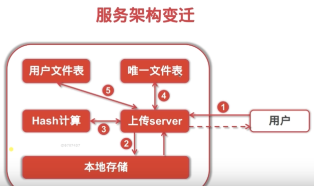

hash计算可以做成微服务


用户文件表

- id
- 用户名（key）
- 文件哈希（和用户名一起，unique key）
- 文件大小
- 文件名
- 上传时间
- 最后更新时间
- 状态（可用/删除）（key）


秒传

查询文件hash（通过浏览器计算文件hash）


分块上传与断点续传

几点说明

- 小文件不建议分块上传（如图片）
- 并行上传分块，且无序
- 极大提高传输效率
- 减少传输失败后重试的流量及时间

redis缓存（分块信息只需要上传过程保留）

- 数据操作频繁，存取效率高

redis连接池（cache）


分布式存储系统

ceph是什么

数据分布式存储的问题

基于私有云，实现分布式存储系统

部署简单

可靠性高

性能高

分布式，可扩展性强

客户端支持多语言

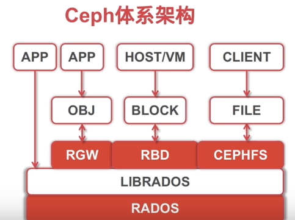


rabbitmq实现异步上传文件

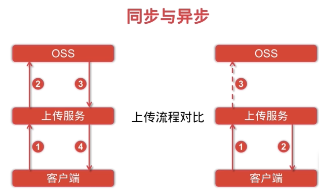

通常需要依赖任务队列

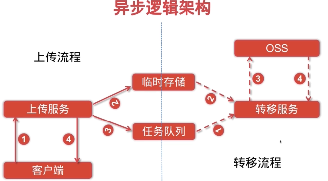

RabbitMQ是什么

- 开源的消息代理
- 面向消息的中间件
- 默认遵循AMQP协议的MQ服务

可以解决

- 逻辑解耦，异步任务
- 消息持久化，重启不影响
- 削峰，大规模消息处理

特点

- 可靠性：持久化、传输确认、发布确认
- 可扩展性：多个节点可以组成一个集群，可动态更改
- 多语言客户端：几乎支持所有常用语言
- 管理界面：易用，便于监控和管理

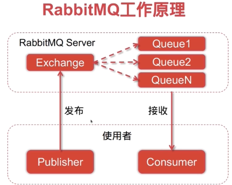

exchange交换机

- 决定消息按什么规则，路由到哪个队列

queue需要绑定exchange

- 消息载体

routing key：路由关键字，exchange根据这个关键字来投递消息

channel：消息通道，需要和生产者和消费者之间建立

工作模式

fanout广播

c1，c2竞争

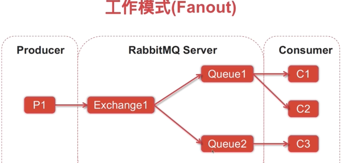

direct单播，和routing key完全匹配

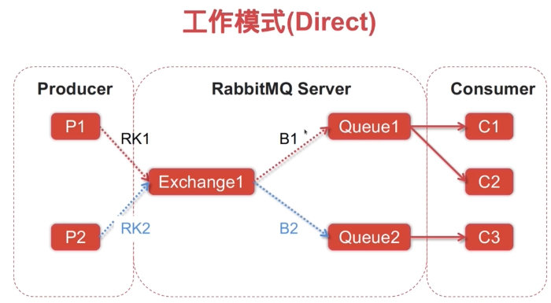

topic 通配符匹配

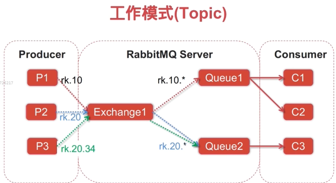


如果**考虑**消息通过rabbitmq存入mysql。这时候就需要主从了，从节点负责读数据，主节点负责写数据。


架构微服务化

微服务是什么：

一种分散治理的开发技术和理念

打包在单体应用 开发维护不容易 崩溃导致整个进程退出 整个服务不可用

打散 独立成微服务 提供单一功能 单独部署 运行 升级

弱耦合，对接接口


应用场景

原有单体应用逻辑复杂，按业务逻辑划分

优点：

- 化繁为简，分散治理
- 服务间松耦合，服务内高内聚
- 服务可独立构建/部署/升级，局部更新
- 提高系统容错性，减少系统整体崩溃概率
- 易于实现异构系统

缺点：

- 运维部署难（docker、k8s）
- 系统间调用逻辑的处理难
- 日志收集和统计难
- 额外引入非业务模块服务（服务注册与发现中心、配置中心、分布式日志收集）


gin框架

- 非常轻巧
- api友好
- 源码注释详细
- 对外部依赖库少

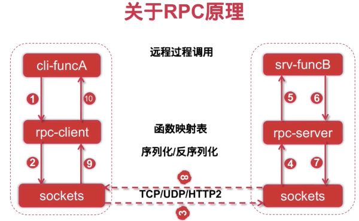

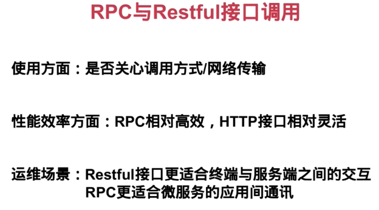

go-micro

 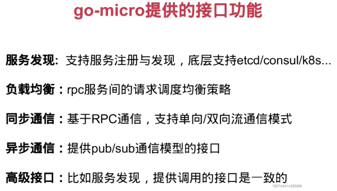

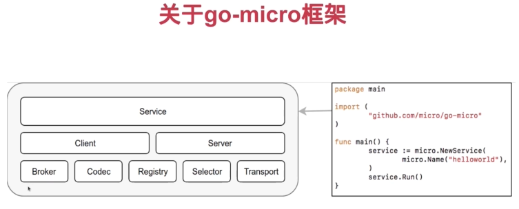

broker：一步通讯

codec：编码解码

registry：服务注册发现

selector：负载均衡

transport：通信模块接口


linux查看进程、线程、空闲内存

linux进程的内存分布

死锁 举例

怎么避免

线程安全

- 线程安全（Thread safety）是多线程编程中的一个概念，它描述的是一个函数、方法或类在多线程环境中的行为。如果一个函数、方法或类是线程安全的，那么它可以被多个线程同时调用，而不会导致数据错误或不一致。

  在多线程程序中，多个线程可能会同时访问和修改同一块内存（例如，全局变量或静态变量）。如果这个过程没有被正确地管理，那么可能会导致数据错误或不一致。例如，一个线程可能在另一个线程还没有完成写操作的时候就开始读数据，这可能会导致读到的数据是不正确的。

  为了解决这个问题，程序员通常会使用各种同步机制，如互斥锁（Mutexes）、读写锁（Read-Write Locks）、信号量（Semaphores）等，来确保在任何时候只有一个线程能够访问和修改共享的数据。

  线程安全的代码需要仔细设计和实现，以防止出现线程冲突和数据不一致。在编写多线程程序时，线程安全是一个非常重要的考虑因素。

c++虚函数的底层

- C++ 的虚函数是通过一种叫做 "虚函数表"（也称为 "vtable"）的机制来实现的。每一个有虚函数的类（或者说，每一个多态的类）都有一个对应的虚函数表。这个表是一个存储函数指针的数组，这些函数指针指向类的虚函数。

  每一个类的对象都有一个指向虚函数表的指针，这个指针通常是在对象的内存布局的开始位置。当调用一个对象的虚函数时，编译器会生成代码来查找虚函数表，然后通过表中的函数指针来调用正确的函数。这个过程是在运行时进行的，所以能够实现动态绑定，也就是多态。

  以下是一个简化的示例：

  ```cpp
  class Base {
  public:
      virtual void func() {}
  };
  
  class Derived : public Base {
  public:
      void func() override {}
  };
  
  Base* obj = new Derived();
  obj->func();  // 调用 Derived::func()
  ```

  在这个例子中，`Base` 类和 `Derived` 类都有各自的虚函数表。`Base` 类的虚函数表中有一个函数指针，指向 `Base::func`，而 `Derived` 类的虚函数表中有一个函数指针，指向 `Derived::func`。

  当我们创建一个 `Derived` 类的对象并用 `Base` 类的指针 `obj` 来引用它，`obj` 的虚函数表指针会指向 `Derived` 类的虚函数表。所以当我们调用 `obj->func()` 时，实际上调用的是 `Derived::func`，而不是 `Base::func`。

  需要注意的是，虚函数表和虚函数表指针的具体实现可能会因编译器和平台的不同而不同。上面的描述是一种常见的实现方式，但不是唯一的方式。

字节流（大小端）

- 大端（Big-Endian）和小端（Little-Endian）是两种不同的字节序（Byte Order）方式，它们决定了多字节数据（如16位、32位、64位的整数）在内存中如何存储，以及在字节流中如何表示。

  1. 大端字节序（Big-Endian）：最高**有效**字节（Most Significant Byte，MSB）在最低的内存地址处，最低有效字节（Least Significant Byte，LSB）在最高的内存地址处。也就是说，大的“端”在前。例如，一个 4 字节的整数 `0x12345678` 在内存中将被存储为 `12 34 56 78`。
  2. 小端字节序（Little-Endian）：最低有效字节在最低的内存地址处，最高有效字节在最高的内存地址处。也就是说，小的“端”在前。同样的例子，整数 `0x12345678` 在内存中将被存储为 `78 56 34 12`。

  字节序的选择取决于使用的硬件平台或协议规定。例如，Intel 的 x86 架构采用的是小端字节序，而网络协议（如 TCP/IP）通常使用大端字节序（也称为网络字节序）。

  在处理跨平台的数据交换时，字节序问题非常重要，因为不同的系统可能采用不同的字节序，这可能会导致数据解析错误。因此，需要进行字节序的转换，以确保数据在不同的系统之间正确地传输和解析。

网络字节流

- 网络字节序通常是大端字节序。也就是说，无论源系统和目标系统的字节序如何，数据在网络中传输时都应该转换为大端字节序。在源系统中，如果数据的原始字节序不是大端字节序，那么在发送数据之前需要将数据从原始字节序转换为大端字节序；在目标系统中，如果系统的字节序不是大端字节序，那么在接收数据后需要将数据从大端字节序转换为系统的字节序。

  在 C 和 C++ 的网络编程中，通常使用 `htonl`、`htons`、`ntohl` 和 `ntohs` 这四个函数来进行字节序的转换。`htonl` 和 `htons` 将主机字节序转换为网络字节序，`ntohl` 和 `ntohs` 将网络字节序转换为主机字节序。这里的 "n" 代表 "network"（网络），"h" 代表 "host"（主机），"l" 代表 "long"（长整数），"s" 代表 "short"（短整数）。

tcp、udp

三次握手

tcp状态机

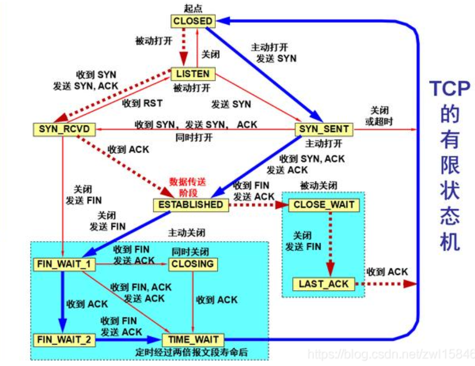

- 客户端tcp状态迁移

  CLOSED->SYN_SENT->ESTABLISHED->FIN_WAIT_1->FIN_WAIT_2->TIME_WAIT->CLOSED

  服务器TCP状态迁移：

  CLOSED->LISTEN->SYN收到->ESTABLISHED->CLOSE_WAIT->LAST_ACK->CLOSED

四次挥手

半连接

- "半连接"（Half-Open Connection）是指 TCP 连接中的一种特殊状态，通常发生在网络中断或者延迟很高的情况下。在这种状态下，连接的一方认为连接已经关闭，而另一方则认为连接仍然打开。

  具体来说，TCP 连接的关闭通常需要四次挥手。假设 A 和 B 之间有一个 TCP 连接，A 发送 FIN 包给 B，表示 A 想要关闭连接。这时，如果 B 收到了 A 的 FIN 包，但 A 没有收到 B 对 FIN 包的 ACK（确认），那么 A 可能会认为连接还没有关闭，而 B 则认为连接已经关闭。这就是一种半连接状态。

  半连接状态可能会导致一些问题。例如，如果 B 认为连接已经关闭，那么 B 可能会释放与这个连接相关的资源，如套接字、缓冲区等。然后，如果 A 继续发送数据，B 可能会因为没有足够的资源来处理这些数据而发生错误。为了避免这种情况，TCP 协议定义了一种机制，即当一方收到对方的 FIN 包后，它会等待一段时间（通常是 2 倍的最大段生命周期，MSL）再关闭连接，这个状态被称为 TIME_WAIT。这样可以确保对方收到了 ACK，从而避免半连接状态。

syn flood？

- SYN Flood（SYN洪水攻击）是一种常见的拒绝服务（DoS）攻击方法。该攻击利用了TCP协议的三次握手过程。在正常的TCP三次握手过程中，客户端会发送一个SYN（Synchronize）包以请求建立连接，服务器会回复一个SYN-ACK（Synchronize-Acknowledge）包，然后客户端会发送一个ACK（Acknowledge）包，这样连接就建立了。在这个过程中，当服务器收到SYN包并发送了SYN-ACK包后，它会在内存中为这个半开放的连接分配一些资源，等待客户端的ACK包。

  在SYN Flood攻击中，攻击者会连续发送大量的SYN包到服务器，但不会发送ACK包。这样，服务器就会为这些半开放的连接分配大量的资源，而这些资源实际上是被浪费的，因为连接从未被完全建立。如果攻击的强度足够大，服务器的资源可能会被耗尽，导致正常的连接请求无法被处理，从而实现了拒绝服务的目的。

  为了防御SYN Flood攻击，有一些方法可以使用，例如限制来自同一源IP的SYN包的数量，或者使用SYN cookies等技术。SYN cookies技术可以在不需要分配大量资源的情况下处理SYN包，从而避免了资源被耗尽的问题。

  在TCP的三次握手过程中，当服务器收到客户端的SYN（Synchronize）包并回复SYN-ACK（Synchronize-Acknowledge）包后，这个连接就进入了"SYN_RECEIVED"状态，这个状态也被称为"半开放"状态。在这个状态下，服务器已经准备好接收客户端的ACK（Acknowledge）包，以完成连接的建立，但是这个ACK包还没有到达。

  如果服务器没有收到这个ACK包，连接就会停留在"半开放"状态。这可能是因为ACK包在网络中丢失，或者是因为客户端没有发送ACK包（例如，在SYN Flood攻击中）。无论是哪种情况，服务器都会为这个半开放的连接分配一些资源，如内存、套接字等，以等待ACK包的到来。如果ACK包在一定时间内没有到达，服务器通常会关闭这个半开放的连接，以释放资源。

  因此，"半开放"连接并不意味着连接已经完全建立，而是指连接正在建立的过程中，已经完成了一半的握手过程（即，已经发送了SYN-ACK包，正在等待ACK包）。

 lvs?

有没有抓包过tcp，用的什么命令？

linux下抓包过吗？

http

200

302什么协议？

https

对称加密和非对称加密

线程和协程

常见的查找：二分、哈希、二叉搜索

- 哈希冲突

epoll

epoll和select的区别

红黑树

怎么实现

为什么叫红黑树

redis的跳表

为什么用跳表而不是二叉搜索树

常见的排序

稳定

堆排序

golang defer执行顺序

main里面

println("return", func)

里面还有一些i，defer


jwt token。

可以伪造payload吗？

相比于cookie、session、双token的优势？劣势？

- JWT（JSON Web Token）是一种开放的标准 (RFC 7519)，定义了一种简介的方式，用于安全地在双方之间传输信息作为一个 JSON 对象。这个信息可以被验证和信任，因为它是数字签名的。

  **JWT的优势**：

  1. **无状态和可扩展性**：JWT是无状态的，也就是说服务器不需要存储用户的会话信息。这使得JWT可以很容易地在多个服务器之间扩展。
  2. **自包含**：JWT包含了所有用户的认证信息，避免了多次查询数据库。
  3. **跨域**：因为JWT是通过HTTP头部传输的，所以它可以在不同的域之间传输，这是cookie无法做到的。

  **JWT的劣势**：

  1. **存储**：JWT的大小通常比session ID大，如果在HTTP头部传输，可能会增加请求的大小。
  2. **安全**：如果JWT被窃取，那么就可以被用来伪造用户的身份。虽然JWT可以加密，但是这会增加其复杂性。
  3. **失效问题**：JWT一旦签发后，在到期时间之前将会一直有效，不像session那样可以随时废弃。因此，JWT一旦泄露，攻击者可以在令牌过期之前一直使用该令牌。

  **相比于cookie、session、双token**：

  1. **与cookie和session相比**：cookie和session需要在服务器上存储会话状态，而JWT是无状态的，这使得JWT在分布式应用中更加易于扩展。然而，cookie和session可以更安全地处理敏感信息，因为它们不需要在客户端存储所有的信息。
  2. **与双token相比**：双token机制通常使用一个access token和一个refresh token，access token有较短的生命周期，而refresh token有较长的生命周期。当access token过期时，可以使用refresh token来获取新的access token。这种机制可以提高安全性，因为即使access token被窃取，它也只能在短时间内使用。然而，这种机制的复杂性也更高，因为需要处理两种不同的token。而JWT只需要一个token，简化了认证过程。

如果大量用户在线，什么都不做？哪里先崩溃？

websocket长连接过多？内存占用？goroutine不太占内存吧

- **内存消耗**：每个 WebSocket 连接和每个协程都会消耗一定的内存。如果用户数量非常大，那么内存消耗可能会成为瓶颈。当内存用尽时，系统可能会开始使用虚拟内存（即磁盘上的交换空间），这会大大降低系统的性能。如果虚拟内存也用尽，那么系统可能会崩溃。

- **文件描述符限制**：在 Unix-like 系统中，每个进程都有一个打开文件描述符的数量限制。因为每个 WebSocket 连接都需要一个文件描述符，所以如果连接数量太多，可能会达到这个限制，导致新的连接无法创建。

  - 在 Unix-like 系统中，每个进程都有一个打开文件描述符的数量限制。这个限制的具体数值取决于你的系统配置，但通常默认值是 1024 或 4096。

    你可以通过以下命令在 shell 中查看或修改这个限制：

    - 查看当前 shell 的文件描述符限制：`ulimit -n`
    - 设置当前 shell 的文件描述符限制：`ulimit -n <number>`

    需要注意的是，这些命令只会影响当前 shell 和从当前 shell 启动的进程。如果你需要永久地改变文件描述符限制，你可能需要修改 `/etc/security/limits.conf` 文件或者使用类似 `systemd` 的服务管理工具。

    另外，对于需要处理大量并发连接的服务器应用，如你的 WebSocket 服务器，通常需要将文件描述符限制设置得较高，以防止达到这个限制。

- **CPU 资源**：虽然在你的描述中，用户“什么都不做”，但是每个协程仍然会消耗一些 CPU 资源。如果协程数量太多，CPU 可能会成为瓶颈。
- **网络带宽**：每个 WebSocket 连接都会占用一定的网络带宽。即使用户“什么都不做”，WebSocket 连接仍然需要定期发送心跳包来保持连接。如果用户数量非常大，网络带宽可能会成为瓶颈。

索引有什么用？索引流程

- **提高查询速度**：索引可以显著提高数据查询速度，尤其是在大型数据库中。没有索引的查询可能需要扫描整个表来找到匹配的行，这在大型数据库中可能非常慢。而有了索引，数据库可以直接定位到匹配的行，大大减少了查询时间。
- **提高排序和分组操作的速度**：索引可以用于快速排序和分组数据。
- **实现唯一性约束**：某些类型的索引（如唯一索引）可以用来强制表中的某列或某几列的值是唯一的。
- 索引查询的流程大致如下：
  1. **解析查询**：首先，数据库系统需要解析查询，确定查询的语义，以及可能用到的表和列。
  2. **选择索引**：一旦数据库系统知道了查询需要访问哪些表和列，它就会查看这些表和列的索引，然后选择一个或多个索引来执行查询。数据库系统会使用一种叫做查询优化器的组件来做这个决定。查询优化器会考虑多种因素，如索引的类型、索引覆盖的列、查询的谓词等，然后选择一个预计会最快的执行计划。
  3. **读取索引**：在选择了索引后，数据库系统会读取索引的数据。具体的读取方式取决于索引的类型。例如，对于 B-tree 索引，数据库系统会从树的根节点开始，沿着树的路径向下搜索，直到找到匹配的叶节点。对于哈希索引，数据库系统会计算查询值的哈希，然后直接定位到哈希表的相应位置。
  4. **检索数据**：索引通常只包含索引列的值和一个指向实际数据行的指针（例如，行的物理地址或行ID）。一旦数据库系统找到了匹配的索引项，它就可以使用这个指针来检索实际的数据行。
  5. **返回结果**：最后，数据库系统将检索到的数据行返回给用户。

没有索引时数据库怎么查找

数据库存整本红楼梦，搜林黛玉，数据库怎么查？

- **全文索引**：

  全文索引是一种用于支持全文搜索的索引。全文搜索是一种在大量文本数据中查找特定词或短语的搜索技术。全文索引通过对所有文档中的每个词进行索引，使得查询可以快速找到包含特定词或短语的文档。

  全文索引通常包括一个词表（或称为词典），它包含了所有的唯一词，以及每个词在哪些文档中出现。在创建全文索引时，数据库系统会对每个文档进行分词，然后将每个词和它在文档中的位置添加到索引中。

  **倒排索引**：

  倒排索引是全文索引的一种常见形式。倒排索引的主要思想是，对于每一个唯一的词，都有一个列表，列表中包含了包含这个词的所有文档。

  在倒排索引中，每个词都关联一个文档列表，这个列表称为倒排列表。倒排列表中的文档通常按照某种顺序（如文档ID）排序，这使得数据库系统可以快速合并多个倒排列表，以支持对多个词的查询。

  例如，如果你搜索包含"林黛玉"和"贾宝玉"的文档，数据库系统会找到这两个词的倒排列表，然后合并这两个列表，找出同时包含这两个词的文档。

  倒排索引是全文搜索中的核心技术，它使得全文搜索能够在大量文本数据中快速找到包含特定词或短语的文档。

go build之后的流程

- `go build`是Go语言的一个编译命令，它的主要作用是把Go语言源代码编译成可执行文件。以下是`go build`命令执行的完整流程：

  1. **解析包导入**：首先，编译器会解析源代码中的`import`语句，找出代码依赖的所有包。
  2. **依赖包的编译**：编译器会先编译源代码依赖的包。这个过程是递归的，也就是说，如果一个包依赖于其他包，那么这些被依赖的包也会被编译。编译的结果是每个包的一个对象文件，这个文件包含了包的编译后的代码。
  3. **主包的编译**：编译器接着编译主包，也就是包含`main`函数的包。编译的结果是主包的一个对象文件。
  4. **链接**：链接器将主包和所有依赖的包的对象文件链接在一起，生成一个可执行文件。链接的过程中会解析和处理符号引用（比如函数和变量的引用），并把这些引用替换成实际的内存地址或偏移量。
  5. **生成可执行文件**：链接器生成的最终输出是一个可执行文件。这个文件包含了程序的机器代码，以及用于运行程序的各种其他信息，比如数据段、符号表等。

  在这个过程中，`go build`还会做一些其他的工作，比如检查代码中的错误，优化生成的代码等。但以上五步是最主要的工作。

  需要注意的是，`go build`生成的可执行文件是静态链接的，也就是说，所有的依赖都被打包进了可执行文件。这使得Go的可执行文件可以在没有安装任何依赖的环境中运行，非常适合在容器等环境中使用。

画图介绍一个系统，画几张图？什么图？


消息结构体

存几条记录？

一条就可以了

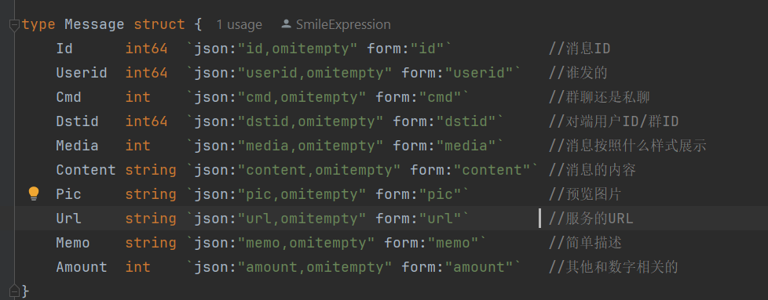

群聊？

群与用户关系的表？

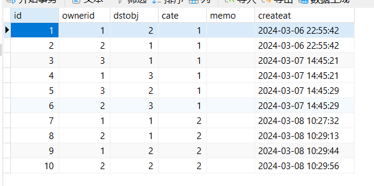

一张也足够了，cate=1为私聊，cate=2为群聊。这张表为用户关系表（包括群聊）

表情包存储？收藏

- 用户与表情包的关系表

每个用户的top10表情包

- redis的zset

zset的数据结构

跳表。时间复杂度

多进程多线程多协程的应用场景

1. **多进程**：每个进程都有自己的内存空间，因此进程间的数据隔离性好，不会出现数据竞争的问题。多进程适用于CPU密集型任务，因为每个进程可以在一个CPU核心上独立运行。此外，如果一个进程崩溃，它不会影响其他进程。然而，进程的创建和切换成本较高，且进程间通信(IPC)复杂。多进程常用于Web服务器、数据库系统等。
2. **多线程**：线程是进程内的执行单元，同一进程内的线程共享内存空间，因此线程间的数据交互和通信更容易。多线程适用于I/O密集型任务，如网络I/O、磁盘I/O等，因为在等待I/O操作完成时，其他线程可以继续运行。然而，多线程需要处理好数据同步和锁的问题，否则可能会出现数据竞争和死锁。多线程常用于GUI程序、游戏等。
3. **多协程**：协程(Coroutine)可以看作是轻量级的线程，它们在一个线程内部运行，切换成本极低。由于协程是协作式的，所以不需要锁和同步机制就可以实现并发。多协程适用于高并发的I/O密集型任务，如Web爬虫、微服务等。然而，协程需要特定的编程模型支持，且协程的错误处理和调试可能较复杂。

为什么协程比线程好？

- 资源消耗小：协程轻量，内存占用小。
- 上下文切换：协程只发生在用户态，线程需要在用户态和内核态之间进行切换。
- 阻塞和同步：线程间同步通常需要使用锁、信号量等机制，协程可以用管道。

为什么应用程序管理协程切换会比操作系统管理线程切换开销更小。

1. **上下文切换**：线程的上下文包括了许多信息，如程序计数器、寄存器、虚拟内存信息等。当操作系统从一个线程切换到另一个线程时，它需要保存当前线程的上下文，然后恢复另一个线程的上下文。这个过程需要在用户态和内核态之间进行切换，消耗的时间和资源较多。相比之下，协程的上下文只包括了栈和程序计数器，因此保存和恢复的开销更小。
2. **调度器的复杂性**：线程的调度由操作系统的调度器进行，它需要考虑许多因素，如优先级、公平性、资源管理等。因此，线程的调度算法通常比较复杂，消耗的资源较多。相比之下，协程的调度由应用程序进行，它通常只需要一个简单的调度算法，如轮转法（Round-Robin）或者优先级调度。

内核态是什么？

**内核态（Kernel Mode）**：也被称为**特权**模式或系统模式，是**操作系统代码**运行的环境。在内核态下，代码具有**访问和控制硬件资源**的全权限，可以执行任何CPU指令，包括那些可能影响系统安全和稳定性的指令。操作系统的核心部分，如内核、设备驱动等通常运行在内核态。

**用户态（User Mode）**：是应用程序代码运行的环境。在用户态下，代码不能直接访问硬件资源，只能通过系统调用（System Call）来请求操作系统提供的服务。如果用户态的代码试图执行特权指令，或者访问受保护的内存，CPU会产生一个异常，由操作系统来处理。

每个线程开启多少个协程？

一个线程可以开启的协程数量并没有硬性的限制，它主要取决于以下几个因素：

1. **内存限制**：每个协程都需要一些内存来存储其执行环境（如栈、寄存器等）。虽然协程的内存开销远小于线程，但如果创建的协程数量过多，仍然可能耗尽系统的内存。
2. **CPU利用率**：协程的切换和调度也需要消耗CPU资源。如果创建的协程数量过多，可能会导致CPU在协程的切换和调度上花费过多的时间，而不是在执行实际的任务。
3. **任务的性质**：如果任务是CPU密集型的，那么创建过多的协程可能并不会提高程序的效率，反而可能因为过多的上下文切换而降低效率。如果任务是I/O密集型的，那么创建更多的协程可以提高程序的效率，因为当一个协程在等待I/O时，其他的协程可以继续执行。
4. **协程的管理和调度**：如果创建的协程数量过多，可能会增加协程的管理和调度的复杂性。例如，你可能需要更复杂的数据结构来存储和查找协程，或者更复杂的算法来决定哪个协程应该被执行。

IO密集型和计算密集型？核心数一样，哪些线程多比较好？

1. **计算密集型任务**：这类任务主要消耗的是CPU资源，如科学计算、图像处理、机器学习等。对于这类任务，通常的做法是创建的线程数与系统的CPU核心数相等，或者稍微多一些。这样可以最大程度地利用CPU资源进行并行计算。如果创建的线程数过多，可能会导致频繁的上下文切换，从而降低CPU的利用率。
2. **I/O密集型任务**：这类任务主要消耗的是I/O资源，如网络请求、磁盘读写等。对于这类任务，由于大部分时间都在等待I/O操作，CPU资源并不是瓶颈。因此，通常会创建更多的线程，以便在一个线程等待I/O操作时，其他线程可以继续执行。实际的线程数取决于具体的I/O负载和系统的性能，可能会远大于CPU的核心数。

事务隔离级别


rpc？二进制协议？

分布式系统。

redis主从复制的缺点。如果出现了网络问题，怎么解决？

怎么保证强一致性？业界的强一致性算法。

大量用户，map需要加锁，怎么优化？

redis和ceph的分片是怎么做的

socket调用accept的时候，是处于半连接还是全连接呢？

- 当调用 `accept()` 函数时，通常是在 "全连接" 状态，也就是说，三次握手已经完成，TCP 连接已经建立。`accept()` 函数会从已完成连接的队列中取出一个连接，返回一个新的 socket 描述符，用于和客户端进行通信。如果已完成连接的队列为空，那么 `accept()` 函数会阻塞，等待连接到来。

  所以，当 `accept()` 函数返回时，通常表示一个完全建立的 TCP 连接已经准备好，可以进行数据传输。